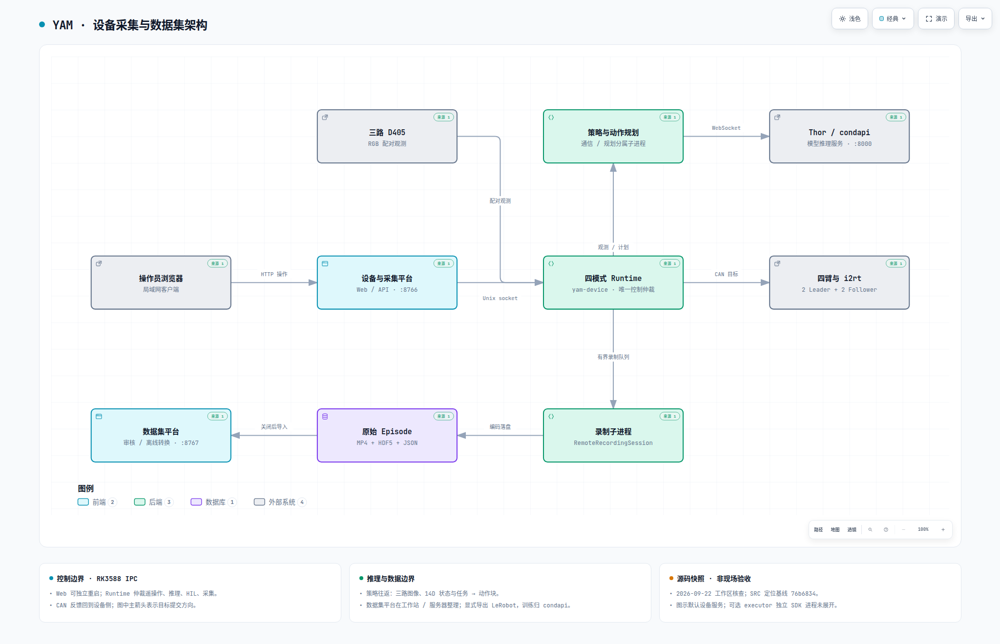

# YAM 双臂工作站

**从遥操作示范、模型执行与人工纠正，到数据审阅和训练集导出。**

面向两台官方电动 YAM Leader、两台 YAM Follower 和三台 RealSense D405，提供一套浏览器操作的设备与数据工作流。RK3588 IPC 负责现场控制与采集，Thor 负责模型推理；训练、检查点转换和模型服务由 `condapi` 项目管理。

[快速开始](#快速开始) · [运行架构](#运行架构) · [采集与接管](#采集与接管) · [数据合同](#数据合同) · [文档中心](docs/README.md)

> 当前仓库包含已现场使用的功能和新近离线验证的改动，并非全部已部署到 IPC。请以 [验收状态](docs/acceptance.md) 和 [部署边界](docs/deploy.md) 区分代码能力、运行版本与真机验证。

## 两个平台，一条数据链路

| 平台 | 使用者与主要能力 | 默认端口 |
|---|---|---|
| **设备与采集工作台** | 设备连接与初始化、零位与重力补偿、关节调试、遥操作、推理、HIL 接管、分集录制和恢复 | `8766` |
| **数据集工作台** | 原始/LeRobot 数据导入、三路视频审阅、完整性检查、分类与集合、转换、移除/恢复和打包迁移 | `8767` |

两平台独立运行。浏览器不安装机械臂 SDK；离线数据整理不要求机械臂或 Thor 在线。原始数据保存完成后显式导入数据平台，不在控制循环中执行转换或训练。

### 四种运行模式

| 模式 | Follower 动作来源 | Leader 行为 | 录制方式 |
|---|---|---|---|
| 遥操作 `teleop` | 操作者 | 重力与 SDK 摩擦补偿、手动增益 | 不录训练集 |
| 数据采集 `collect` | 与遥操作共用人工实现 | 同上 | 页面/手柄开始、结束或放弃 |
| 推理 `inference` | 模型动作 | 不镜像、不参与控制 | 开始执行后记录 rollout |
| DAgger / HIL `hil` | 模型与人工纠正切换 | 策略阶段跟随目标，人工阶段复用遥操作 | 同集保留策略与人工数据，剔除指定等待段 |

所有人工路径共用**绝对关节 1:1 映射**，不另设 HIL 相对位移实现。纯遥操作不要求任务或相机；正式录制与模型执行需要对应任务和有效观测。

## 快速开始

### 1. 安装

面向 Linux 开发机/IPC，使用 Python 3.12 与 `uv`。先按 [环境手册](docs/environment.md#首次安装) 安装系统编译依赖及 uv；仓库固定的 SDK 包含需编译的依赖。

```bash
git clone --recurse-submodules https://github.com/robot1lyj/YAM_ABC_Infra.git YAM
cd YAM

scripts/apply_i2rt_safety_patches.sh
uv python install 3.12.14
uv sync --locked --extra camera --extra gui --extra deploy
```

已有普通克隆先执行 `git submodule update --init --recursive`。项目已配置国内 PyPI 镜像；它不加速 Git 子模块或模型下载。IPC 不需要安装 Torch、JAX 或 TensorRT，也不要混装互斥训练依赖组。内网仓库与安装排障见 [环境手册](docs/environment.md)。

### 2. 无硬件体验

```bash
# 只检查配置与依赖是否可发现，不连接设备、不创建数据目录
uv run --no-sync yam-workstation --mock --mode collect --check

# 打开模拟工作台
uv run --no-sync yam-workstation --mock --mode collect --web-port 8766
```

浏览器打开 [本机设备工作台](http://127.0.0.1:8766/)。按页面连接模拟设备、选择模式、明确开始；mock 不连接真实机械臂、相机或 Thor。

使用 HTTP 入口，**不要直接打开静态 index.html**：页面依赖后端状态和资源路由。配置检查通过也不代表二进制依赖、硬件或实时性能通过。

### 3. 打开数据集工作台

已有项目环境：

```bash
uv run --no-sync python -m yam_abc_reproduce.dataset_workbench.web \
  --catalog ./data/catalog --port 8767
```

打开 [本机数据集工作台](http://127.0.0.1:8767/)。仅需离线整理、无需设备环境时，可从仓库使用独立依赖入口：

```bash
uv run --locked --script scripts/dataset_workbench.py \
  --catalog ./data/catalog --port 8767
```

独立入口不安装机械臂 SDK 或模型训练后端。导入范围、原件保护、转换与迁移见 [数据集操作手册](docs/dataset_workbench.md)。

## 运行架构

[](docs/architecture/yam.html)

[打开交互架构图](docs/architecture/yam.html) · [图的源码依据](docs/architecture/README.md) · [完整架构合同](docs/dagger_architecture.md)

架构图为 2026-09-22 源码快照，不是在线监控；未展开可选 executor 和 RTC 内部时间线。托管页面无法直接运行 HTML 时，下载 `yam.html` 后用浏览器打开。

### 按资源生命周期分工

| 边界 | 职责 |
|---|---|
| Web / API | 用户命令、状态和中文诊断；不拥有机械臂 SDK |
| 设备 Runtime | 30 Hz 控制仲裁、HOLD/介入/维护、epoch、目标提交 |
| Thor 通信 / 动作规划 | 单在途推理、响应校验、动作块处理；不写电机 |
| SDK / CAN | 设备反馈、硬限位、实际下发和通道所有权 |
| 录制 / 编码 / 预览 | 有界队列、磁盘暂存、视频与数值写入、低频预览 |
| 数据集平台 | 索引、审阅、恢复、转换与迁移；不参与实时控制 |

控制循环不等待网络推理、视频编码或停录后的保存排空。独立进程仍共享 CPU、内存带宽、USB 和磁盘，不能据此承诺硬实时或无限录制时长。

**默认 `yam-device` 仍持有 SDK。** 可选 `yam-executor` 常驻执行层已实现并通过离线测试，但尚未迁移 IPC；不能把“Web 已解耦”理解成“重启任何服务都不掉使能”。

## 采集与接管

### 遥操作与分集录制

- **验证设备**：连接机械臂 → 保持 → 明确开始遥操作。无需先建采集任务。
- **开始采集**：暂停 → 连接相机、选择任务 → 切到采集 → 开始遥操作 → 手柄①开录。
- **保存或放弃**：再次①结束保留；②放弃当前活动集，不删除之前的好数据。
- **切换任务**：HOLD、结束介入/维护、保存完成后创建新的数据 session，无需为换任务断臂。

任务有稳定 UUID、中文显示名/说明和英文 task；模型 prompt 使用英文 task。切任务不改写旧数据身份。按钮具体条件见 [采集手册](docs/collect.md)。

### HIL 人工纠正

1. **介入**：Follower 保持，Leader 辅助对齐。
2. **右 Leader①**：进入人工遥操作，不要求对齐误差达标。
3. **人工阶段再按①**：两侧保持，Leader 高增益锁定。
4. **页面“交还模型”**：获取新观测和新计划，恢复策略。

人工①只锁定，不自动交还；②在 HIL 中无功能。绝对映射意味着未对齐时 Follower 可能追向 Leader 姿态，不能承诺接管首帧无跳变。

推理/HIL 暂停运动会结束当前集；下一次明确开始创建新集。解除软件停止锁存、服务恢复或浏览器重新连接都不自动恢复运动。

## 模型推理

仅保留三种用户可选路径，不能混用其时间合同：

| 模式 | 执行规则 | 动作块衔接 |
|---|---|---|
| `sync_hold` | 完整执行50步，保持并请求下一块 | 从新块第0步执行，不融合 |
| `tda_smooth` | 单在途异步预取，按请求期间实际消费步数对齐 | 复用 OpenArm-vr 的重叠队列融合，包含夹爪 |
| `rtc` | 明确30 Hz目标 tick，发送已承诺前缀 | 从约定 tick 接管；前缀不改写，迟到不顺延 |

当前默认上层以 **30 Hz 直接向 SDK 提交目标**，本站100 Hz二阶通道关闭、仅作备用；已验证不合适的100 Hz纯线性通道不恢复。TDA不是RTC，默认路径也不再使用基于实测位置的应用层速度包络。

Thor 返回有限的 `(50,14)` **绝对目标**：

- 顺序：左6关节、左夹爪、右6关节、右夹爪。
- 关节单位 rad；夹爪名义0闭、1开。
- Thor 负责反归一化、delta还原和去除填充；IPC不重复处理。
- SDK硬限位、夹爪范围、时效与epoch检查仍保留。

普通模型的夹爪低值实验变换、RTC前缀及计时要求详见 [接口合同](docs/condapi_interface.md)。模式/来源切换应在HOLD且无活动录制时进行；换模型后先做无电机协议验证，不以历史延迟或抓取结果推断新检查点。

## 数据合同

原始记录为 **三路 MP4 + HDF5 + JSON 清单**。逻辑 episode 与物理分段分开：默认60秒切一个文件分段，不因此拆成新的任务集。

```text
任务 UUID/
└── session_…/
    ├── session.json
    └── episode_000001/
        ├── manifest.json
        ├── segment_000000/
        │   ├── samples.h5
        │   ├── 三路视角 MP4
        │   └── segment.json
        └── segment_000001/
```

记录区分模型候选、人工输入、最终提交目标和实测反馈，并保留控制来源、介入编号、有效性、请求计时和相机时间信息。**训练 action 取最终提交目标，不把反馈或原始 Leader 输入冒充动作标签。**

HIL 删除“介入等待人工”和“人工锁定等待交还”两类等待段，视频与数值帧一起过滤；交还后等待模型的 RESUME 不属于这两类。保留连续 `frame_index / timestamp` 供训练，同时保留原始 `tick / time` 和删段摘要供审计——训练时间连续不代表物理轨迹无缝。

录制可以在结束后继续排空。失败集保留诊断和可恢复原件；恢复另写新目录，不保证救回未落盘 RAM。字段、有效标记和专家筛选归 [数据字段](docs/hil_dataset_fields.md) 与 [转换手册](docs/convert.md)。

### 显式导出 LeRobot v3.0

```bash
uv run --locked --script scripts/convert_lerobot.py \
  /data/raw/yam --output /data/lerobot/batch_001
```

路径替换为实际输入/输出；只对保存完成的数据操作。支持单集、会话及多会话目录，工作台不会在退出时自动转换。人工纠正训练须使用专家筛选，不能把整集策略和保持帧当人工示范。

## 真机部署与恢复

设备配置入口为 [station_hil.yaml](configs/station_hil.yaml)，包含四路CAN角色、三台相机身份和夹爪行程。它是本工作站配置，不是任意设备通用标定；迁移前按 [工作站手册](docs/workstation.md) 复核。

正式部署使用独立的 `yam-workstation` Web/API 与 `yam-device` 设备服务。默认开发命令仅监听本机；局域网绑定和 Host/Origin 配置见 [运行手册](docs/hil_quickstart.md#环境与无硬件试用)。

| 更新 / 故障 | 处理边界 |
|---|---|
| 页面更新 | 刷新静态资源或独立更新 Web；不应关闭 SDK |
| 推理 / 规划失败 | 清计划并HOLD，独立重载对应子进程，明确开始才运动 |
| 录制失败 | 新版后台恢复新数据session，保留失败原件，不重连SDK |
| SDK / CAN失败 | 独立硬件FAULT，策略重载或清页面提示不能解除 |
| 核心控制 / SDK更新 | 默认部署仍需受控重启设备服务，可能释放力矩 |

局部恢复加固、系统盘运行时模板及可选executor的现场落地状态见 [部署边界](docs/deploy.md)；不要把本地实现当成IPC已更新。

### 运动安全

- **连接就可能施加力矩或触发夹爪初始化**，不是点击开始后才有风险。无界面CLI会在启动时构造设备。
- 回零不是写编码器零点；本站Follower与Leader有各自回零入口，没有碰撞规划，完整行程必须清空。
- 重启默认设备服务、断开SDK或退出设备会话可能释放力矩，先确认支撑和现场照看。
- 软件急停/暂停不能替代实体急停；检查现场后明确恢复，不自动重放旧请求。
- 不同时运行其他控制脚本抢占同一CAN，也不通过反复USB重枚举掩盖故障。

## 验证与工程状态

| 状态 | 范围 |
|---|---|
| 有历史现场记录 | 四臂/三相机、双臂遥操作、手柄录制、MPP短集回读、普通/RTC推理与HIL联调 |
| 新近离线验证、待部署 | 故障分域、录制恢复、CAN所有权及相关架构加固 |
| 尚未现场迁移 | 独立SDK executor、系统盘程序与NVMe数据分离 |
| 仍需持续验收 | 长时完整性、录制中运动延迟、故障恢复全流程、每个检查点的任务效果 |

不声明曝光硬同步、任意时长无损录制或NVMe/USB-CAN物理故障已修复。具体测试数量、跳过项、失败复验和来源见 [验收证据入口](docs/acceptance.md)。

在已安装开发依赖的环境执行：

```bash
uv run --no-sync pytest -q
python3 scripts/check_project_memory.py
git diff --check
```

修改公共合同应覆盖采集、回读和转换；修改控制生命周期应覆盖故障、取消、迟到结果和禁止自动恢复运动，不能只测正常按钮路径。

## 文档与代码导航

| 需要了解 | 入口 |
|---|---|
| 日常操作、初始化、手柄、HIL | [运行手册](docs/hil_quickstart.md) · [采集手册](docs/collect.md) |
| 安装、服务、硬件身份 | [环境](docs/environment.md) · [部署](docs/deploy.md) · [工作站](docs/workstation.md) |
| 模块职责、时序、模型协议 | [架构](docs/dagger_architecture.md) · [同步](docs/synchronization_design.md) · [接口](docs/condapi_interface.md) |
| 数据审阅、字段与训练导出 | [数据集平台](docs/dataset_workbench.md) · [字段](docs/hil_dataset_fields.md) · [转换](docs/convert.md) |
| 开发接手、历史依据 | [当前检查点](docs/cache/checkpoint.md) · [记忆路由](docs/cache/context_index.md) · [验收](docs/acceptance.md) |
| 全部文档与旧工具 | [文档中心](docs/README.md) · [legacy说明](docs/legacy_tools.md) |

```text
yam_abc_reproduce/
├── hil/                  四模式、控制仲裁、策略/规划、录制与Web
├── robot/                SDK适配、CAN所有权和模拟设备
├── camera/               相机驱动与采集
└── dataset_workbench/    独立数据平台、索引与后台作业
configs/                 设备与运行配置
deploy/                  服务unit与可选迁移模板
scripts/                 初始化、协议探针、恢复与转换工具
tests/                   离线合同与故障回归
third_party/i2rt/        固定版本机械臂SDK
docs/                    当前规范、历史证据与分层记忆
```

当前规范各有一个所有者；历史试验留在archive/evidence，不覆盖现行合同。项目跟踪依赖锁与配置，不提交虚拟环境、模型、数据或凭据。项目记忆的更新和校验规则见 [记忆维护](docs/memory.md)。

## 来源与许可证

基于 [i2rt-robotics/yam-abc-reproduce](https://github.com/i2rt-robotics/yam-abc-reproduce)，保留上游历史和兼容工具。Evo-RL、Kai0、OpenArm-vr及其他参考的具体复用范围见 [来源记录](docs/reference_sources.md) 与 [接口合同](docs/condapi_interface.md)，不宣称与上游实现完全相同。

主仓库采用 [Apache-2.0](LICENSE)；子模块和外部项目遵循各自许可证。
