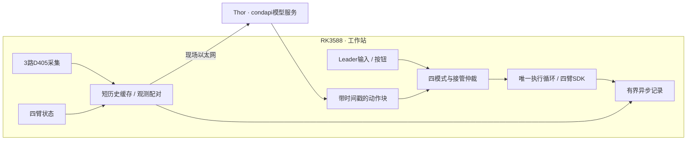

# YAM 双臂工作站

面向 **2 台官方 YAM Leader、2 台标准平行夹爪 Follower、3 台 RealSense D405** 的遥操作、推理、DAgger/HIL 和数据采集工作站。

**Thor 在现场运行模型，RK3588 通过网线与它连接，负责采集、接管、机械臂控制和记录。** 模型训练、微调和 Thor 模型服务归 `condapi` 项目；本仓库负责机械臂侧的运行链路。

当前第一版已完成软件接入和离线验证，**尚未完成真实四臂、D405 和 Thor/RK3588 联调**。先从模拟模式开始。

## 四种模式

| 模式 | Follower 动作来源 | Leader 行为 |
|---|---|---|
| 遥操作 `teleop` | 人工输入 | 重力补偿，读取关节与扳机 |
| 推理 `inference` | Thor 策略 | 不参与控制，不镜像 |
| DAgger/HIL `hil` | 策略与人工本地切换 | 策略时受限镜像，接管时重力补偿 |
| 数据采集 `collect` | 人工输入，手动分段录制 | 重力补偿，顶部按钮开关录制 |

HIL 通过按钮接管，不靠握持或力矩猜测。默认双臂一起切换；切换时废弃旧请求和动作块，交还策略时重新取观测推理。首版采用**非 RTC 异步重规划**，保留普通分块基准。

## 五分钟体验

已有本仓库和环境时，在仓库根目录执行：

```bash
uv sync --locked --extra camera --extra gui --extra deploy
.venv/bin/python -m yam_abc_reproduce.hil.run --mock --web-port 8766
```

打开 [本机工作站界面](http://127.0.0.1:8766)，选择模式并点击“开始”。模拟模式不打开真实机械臂、相机或 Thor。

若 `uv` 不在 PATH，本机路径是 `/home/wuyan-lyj/.local/bin/uv`；虚拟环境位于项目的 `.venv/`。

自动演示策略 → 人工 → 恢复，并连续录制：

```bash
.venv/bin/python -m yam_abc_reproduce.hil.run --mock --demo --duration 4
```

| 操作 | 终端 | 手柄 |
|---|---|---|
| 选择遥操作 / 推理 / HIL / 采集 | `1` / `2` / `3` / `4` | — |
| 开始或从保持恢复 | `s` | 顶部按钮（处于保持时） |
| HIL 接管 / 交还 | 单击 `i` | 任一 Leader 顶部按钮 |
| 采集开始 / 结束一段 | `r` | 顶部按钮（采集模式遥操作中） |
| 保持 | 空格 | 任一 Leader 第二按钮，按住期间禁止启动 |
| 标记成功 / 失败 | `g` / `f` | — |
| 结束会话 | `q` | — |

模式切换先保持并结束上一段。遥操作/推理/HIL持续记录；采集模式仅在明确开始录制后保存。完整操作与故障行为见 [使用教程](docs/hil_quickstart.md)。

## 安装和设备配置

首次克隆后初始化所有子模块，再安装轻量客户端环境：

```bash
git clone --recurse-submodules ssh://git@192.168.110.142:2222/wuyan_lyj/YAM.git
cd YAM
uv python install 3.12.14
uv sync --locked --extra camera --extra gui --extra deploy
```

需要 C++ 编译工具等系统依赖，详见 [环境安装与国内镜像](docs/environment.md)。清华 PyPI 镜像已经配置；它不加速 Git 子模块、Python 安装器和模型下载。不需要在 RK3588 安装模型训练后端。

当前专用配置为 [configs/station_hil.yaml](configs/station_hil.yaml)。真机前填写：

- 两只平行夹爪的实际电机型号；当前保留占位值，没有假定是 4310 或 3507。
- 三台 D405 的实际序列号与 top / left / right 角色。
- CAN 映射、任务 prompt，以及与 condapi 训练匹配的动作采样间隔 `action_dt`。

[硬件事实与初始化顺序](docs/workstation.md)是设备信息的规范入口。主仓库仅使用 `third_party/i2rt` SDK 子模块，不需要同级 `i2rt` 目录。

真机程序构造设备时就可能施加力矩、校准夹爪，**不是点击“开始”才上电**。退出会结束 SDK 控制并可能撤掉力矩，先支撑机械臂；软件保持不替代硬件急停。不默认清零、不运行 GELLO 校准、不自动机械臂回零。

## 运行架构



D405 不支持三机外部硬件同步。本版采用主机接收时间配对、关节历史插值和质量指标；小偏差告警，持续过期才保持。没有为了追求硬同步而引入 ROS2 或多进程重构。

当前是采集线程、控制循环、网络线程与编码线程的轻量结构，**不是硬实时或曝光同步保证**。模型协议见 [condapi 接口](docs/condapi_interface.md)，接管机制见 [当前架构](docs/dagger_architecture.md)，性能取舍见 [同步设计](docs/synchronization_design.md)。

## 数据与专家导出

采集示范：`.venv/bin/python -m yam_abc_reproduce.hil.run --mock --mode collect --web-port 8766`。先按 `s`，再按 `r` 录制；结束前 `g` / `f` 标记，按 `r` 收尾，摆好物体后开始下一段。空格或第二按钮会保持并中断当前片段。详见 [数据采集手册](docs/collect.md)。

每次运行生成一个会话目录，默认在 `data/episodes/`；每段单独保存：

```text
hil_YYYYMMDD_HHMMSS/
├── session.json                  # 关闭后的会话索引、错误与终止状态
├── episode_000001/
│   ├── steps.jsonl               # 状态、来源、动作、同步指标、视频索引
│   ├── top.mp4 / left.mp4 / right.mp4
│   └── manifest.json            # 本段配置、帧数、结果
└── episode_000002/               # 同一会话下一段
```

策略原始建议、人工输入、约束后提交命令和真实反馈分别记录。策略预测缺失时用 `null` 与有效性标记，不用零值伪装预测。写盘队列有界，错误明确标为 `aborted`。

导出连续有效人工段到现有 canonical 格式：

```bash
.venv/bin/python -m yam_abc_reproduce.hil.export data/episodes/实际会话/episode_000001 --output data/expert/新目录
```

不同人工段拆成不同 episode，不把中间的策略段过滤后硬拼轨迹。随后可用保留的 [格式转换工具](docs/convert.md)对接训练；额外 HIL provenance 保留在旁路文件，旧转换器不会自动映射全部 HIL 标签。

## 验证与完成范围

| 状态 | 范围 |
|---|---|
| 已实现、离线验证 | 四模式、官方 Leader 增益切换、接管仲裁、非 RTC 推理、软件配对、连续记录、专家导出、本机界面 |
| 待现场验收 | CAN/方向/夹爪、Leader 增益、D405/USB、Thor 模型契约、端到端时延、任务成功率 |
| 暂不引入 | RTC、时间集成、块间融合、共享内存多进程、曝光时钟校准 |

本轮全套 **172 passed、2 skipped、9 subtests passed**，包含多段采集和双按钮冲突测试。详见 [四模式验收](docs/evidence/20260908-collection-buttons-v1.json)。

代码版本 `1c04c83` 的历史验收：全套 **161 passed、2 skipped、9 subtests passed**；模拟接管和真实本机 HTTP 控制通过。这个数字不代表当前设备状态或 RK3588 性能，详情见 [证据报告](docs/evidence/20260908-hil-runtime-v1.json)。

```bash
.venv/bin/pytest -q
python3 scripts/check_project_memory.py
```

## 文档与项目记忆

| 任务 | 入口 |
|---|---|
| 开始使用 / 真机前配置 | [第一版教程](docs/hil_quickstart.md) |
| 环境 / 国内镜像 / Git | [环境](docs/environment.md) |
| 硬件事实 / 初始化 | [工作站](docs/workstation.md) |
| 模式 / 接管 / 生命周期 | [架构](docs/dagger_architecture.md) |
| 相机 / 多臂同步 / 性能 | [同步设计](docs/synchronization_design.md) |
| 模型接口 / condapi 参考 | [接口约束](docs/condapi_interface.md) |
| 后续接手 | [记忆路由](docs/cache/context_index.md) → [续作检查点](docs/cache/checkpoint.md) |
| 维护记忆 | [记忆规则](docs/memory.md) |
| 旧 GUI / 上游训练与工具 | [保留工具说明](docs/legacy_tools.md) |

记忆存于 Git 内的文档、依赖指纹和验收证据，不依赖外部记忆服务。稳定事实各有一个规范所有者，摘要只做投影。用户已允许放宽上下文字节预算；不因预算暂停工作，也不把写检查点称为自动压缩。

## 目录

```text
configs/station_hil.yaml           当前设备模板与运行阈值
yam_abc_reproduce/hil/             四模式、推理、配对、录制、界面、导出
yam_abc_reproduce/robot/           硬件边界与模拟设备
yam_abc_reproduce/camera/          相机驱动与采集线程
third_party/i2rt/                 固定版本机械臂SDK
docs/cache/                      记忆路由、摘要、检查点、经验记录
docs/evidence/                   历史验证与来源指纹
tests/                           离线验证
```

Git 跟踪 `pyproject.toml`、`uv.lock` 和 `.python-version`；不提交 `.venv/`、数据、模型或运行时 ledger。

## 来源与许可证

本项目基于 [i2rt-robotics/yam-abc-reproduce](https://github.com/i2rt-robotics/yam-abc-reproduce)，保留上游历史与工具。Evo-RL、Kai0 和 Diffusion Policy / UMI 的参考范围见 [源码参考记录](docs/reference_sources.md)。各子模块和外部项目遵循各自许可证；主仓库见 [LICENSE](LICENSE)。
