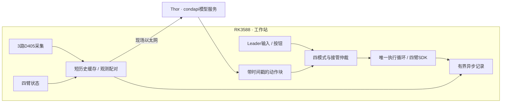

# YAM 双臂工作站

面向 **2 台官方 YAM Leader、2 台标准平行夹爪 Follower、3 台 RealSense D405** 的遥操作、推理、DAgger/HIL 和数据采集工作站。

**Thor 在现场运行模型，RK3588 通过网线与它连接，负责采集、接管、机械臂控制和记录。** 模型训练、微调和 Thor 模型服务归 `condapi` 项目；本仓库负责机械臂侧的运行链路。

当前第一版已完成软件接入和离线验证，**尚未完成真实四臂、D405 和 Thor/RK3588 联调**。先从模拟模式开始。

## 数据集工作台

```bash
uv run --no-sync python -m yam_abc_reproduce.dataset_workbench.web --port 8767
```

打开 [数据集清洗与转换](http://127.0.0.1:8767/)：导入 YAM 原始目录、三路逐帧审阅、完整性检查、失败归类、集合合并、逐集移除/恢复，以及后台转换 LeRobot v3.0。与采集独立运行。详见 [中文操作手册](docs/dataset_workbench.md)。

## 四种模式

| 模式 | Follower 动作来源 | Leader 行为 |
|---|---|---|
| 遥操作 `teleop` | 人工输入 | 重力补偿，读取关节与扳机 |
| 推理 `inference` | Thor 策略 | 不参与控制，不镜像 |
| DAgger/HIL `hil` | 策略与人工本地切换 | 策略时受限镜像，接管时重力补偿 |
| 数据采集 `collect` | 人工输入，手动分段录制 | 重力补偿；①开始/结束，②放弃 |

HIL 通过键盘 `i` 冻结并介入，人工阶段通过手柄①交还模型，不靠握持或力矩猜测。默认双臂一起切换；切换时废弃旧请求和动作块，交还策略时重新取观测推理。首版采用**非 RTC 异步重规划**，保留普通分块基准。

## 五分钟体验

已有本仓库和环境时，在仓库根目录执行：

```bash
uv sync --locked --extra camera --extra gui --extra deploy
uv run --no-sync yam-workstation --mock --mode collect --check
uv run --no-sync yam-workstation --mock --mode collect --web-port 8766
```

打开 [本机工作站界面](http://127.0.0.1:8766)，先创建/选择任务，分别点击“连接相机”和“连接机械臂”，连接成功后选择模式并点击“开始”。模拟模式不打开真实机械臂、相机或 Thor。

若 `uv` 不在 PATH，本机路径是 `/home/wuyan-lyj/.local/bin/uv`；虚拟环境位于项目的 `.venv/`。

自动演示策略 → 人工 → 恢复，并连续录制：

```bash
uv run --no-sync yam-workstation --mock --demo --duration 4
```

| 操作 | 终端 | 手柄 |
|---|---|---|
| 选择遥操作 / 推理 / HIL / 采集 | `1` / `2` / `3` / `4` | — |
| 开始或从暂停恢复 | `s` | — |
| HIL 冻结并介入 | 单击 `i` | — |
| HIL 人工阶段交还模型 | 界面 | 任一 Leader 按钮① |
| 采集开始 / 结束一段 | `r` | 按钮①（采集模式遥操作中） |
| 放弃当前采集集 | `x` | 按钮②（仅采集模式） |
| 暂停运动 | 空格 | — |
| 标记成功 / 失败 | `g` / `f` | — |
| 结束会话 | `q` | — |

遥操作/推理模式的手柄按钮无功能。模式切换先保持并结束上一段。遥操作/推理/HIL持续记录；采集模式仅在明确开始录制后保存。完整操作与故障行为见 [使用教程](docs/hil_quickstart.md)。

## 采集专员工作台

- **悟演智能采集工作台**：白色界面，先建/选任务（中文显示名＋英文task），独立连接相机与机械臂；四模式卡片、三路相机、单集时长/帧数、录制/弃集、结果标记、健康与控制权。
- **设备与调试**：四臂连接状态、Follower关节/夹爪点动、保存准备位、回准备位、重力补偿。
- **恢复流程**：紧急暂停锁存 → 检查现场 → 解除锁存（仍保持）→ 选择开始、回位或重力补偿。
- **预览隔离**：最多5Hz、480×360；独立低优先级进程做JPEG编码，单槽共享内存，只取最新画面。关闭预览会停止预览编码，原始录制继续。

完整操作与限制见 [运行手册](docs/hil_quickstart.md)。软件紧急暂停不能替代物理急停；回位是关节插值，没有碰撞规划，真实路径必须现场核验。

## 安装和设备配置

首次克隆后初始化所有子模块，再安装轻量客户端环境：

```bash
git clone --recurse-submodules ssh://git@192.168.110.142:2222/wuyan_lyj/YAM.git
cd YAM
uv python install 3.12.14
uv sync --locked --extra camera --extra gui --extra deploy
```

需要 C++ 编译工具等系统依赖，详见 [环境安装与国内镜像](docs/environment.md)。清华 PyPI 镜像已经配置；它不加速 Git 子模块、Python 安装器和模型下载。不需要在 RK3588 安装模型训练后端。

当前专用配置为 [configs/station_hil.yaml](configs/station_hil.yaml)。真机前填写：

- 两只平行夹爪的实际电机型号；当前保留占位值，没有假定是 4310 或 3507。
- 三台 D405 的实际序列号与 top / left / right 角色。
- CAN 映射、任务 prompt，以及与 condapi 训练匹配的动作采样间隔 `action_dt`。

[硬件事实与初始化顺序](docs/workstation.md)是设备信息的规范入口。主仓库仅使用 `third_party/i2rt` SDK 子模块，不需要同级 `i2rt` 目录。

使用 `--web-port` 打开工作台时尚不构造设备；点击“连接机械臂”后就可能施加力矩、校准夹爪，**不是点击“开始”才上电**。不带界面的CLI仍在启动时连接。退出会结束 SDK 控制并可能撤掉力矩，先支撑机械臂；软件保持不替代硬件急停。不默认清零、不运行 GELLO 校准；“回准备位”使用本机示教保存的四臂姿态，需操作员明确发起。

## 运行架构



D405 不支持三机外部硬件同步。本版采用主机接收时间配对、关节历史插值和质量指标；小偏差告警，持续过期才保持。没有为了追求硬同步而引入 ROS2 或多进程重构。

当前是采集线程、控制循环、网络线程与编码线程的轻量结构，**不是硬实时或曝光同步保证**。模型协议见 [condapi 接口](docs/condapi_interface.md)，接管机制见 [当前架构](docs/dagger_architecture.md)，性能取舍见 [同步设计](docs/synchronization_design.md)。

## 数据与专家导出

采集示范：`uv run --no-sync yam-workstation --mock --mode collect --web-port 8766`。先创建/选择任务，分别连接相机和机械臂，再按 `s`，然后按 `r` 录制；结束前 `g` / `f` 标记，按 `r` 收尾，摆好物体后开始下一段。手柄②放弃当前集但不暂停遥操作；空格才暂停运动。详见 [数据采集手册](docs/collect.md)。

每次连接创建一个会话；每集采用 **MP4＋HDF5＋JSON清单**，默认60秒一个物理分段，同一长任务仍是一集：

```text
会话/
├── session.json
└── episode_000001/
    ├── manifest.json
    ├── segment_000000/        # samples.h5、三路MP4、segment.json
    └── segment_000001/
```

主要数值分批写HDF5；图像通过固定共享缓冲交给独立编码进程。结束一集即提交清单；录制错误明确标为aborted，旧JSONL集继续可读。工作台和无界面CLI都只采集，不自动转换。完整会话可以上传服务器后，使用独立脚本生成LeRobot v3.0；连续视频优先直接重新封装。

```bash
uv run --locked --script scripts/convert_lerobot.py /data/raw/yam --output /data/lerobot/batch_001
```

脚本有独立依赖锁，不安装机械臂、相机或模型环境；支持单集、会话及多会话目录。

恢复工具保留来源、另写恢复目录，恢复数据必须审核后明确允许导出。字段、恢复和专家筛选见 [数据格式](docs/convert.md)。

## 验证与完成范围

| 状态 | 范围 |
|---|---|
| 已实现、离线验证 | 四模式、官方 Leader 增益切换、接管仲裁、非 RTC 推理、软件配对、连续记录、专家导出、本机界面 |
| 待现场验收 | CAN/方向/夹爪、Leader 增益、D405/USB、Thor 模型契约、端到端时延、任务成功率 |
| 暂不引入 | RTC、时间集成、块间融合、曝光时钟校准 |

当前验收及限制见 [验收记录](docs/acceptance.md)。`cfdc1ed` 的172项历史测试对应旧按钮映射，不能替代本轮按键与数据链路验收。

代码版本 `1c04c83` 的历史验收：全套 **161 passed、2 skipped、9 subtests passed**；模拟接管和真实本机 HTTP 控制通过。这个数字不代表当前设备状态或 RK3588 性能，详情见 [证据报告](docs/evidence/20260908-hil-runtime-v1.json)。

```bash
uv run --no-sync pytest -q
python3 scripts/check_project_memory.py
```

## 文档与项目记忆

| 任务 | 入口 |
|---|---|
| 开始使用 / 真机前配置 | [第一版教程](docs/hil_quickstart.md) |
| 环境 / 国内镜像 / Git | [环境](docs/environment.md) |
| 硬件事实 / 初始化 | [工作站](docs/workstation.md) |
| 模式 / 接管 / 生命周期 | [架构](docs/dagger_architecture.md) |
| 相机 / 多臂同步 / 性能 | [同步设计](docs/synchronization_design.md) |
| 模型接口 / condapi 参考 | [接口约束](docs/condapi_interface.md) |
| 后续接手 | [记忆路由](docs/cache/context_index.md) → [续作检查点](docs/cache/checkpoint.md) |
| 维护记忆 | [记忆规则](docs/memory.md) |
| 旧 GUI / 上游训练与工具 | [保留工具说明](docs/legacy_tools.md) |

记忆存于 Git 内的文档、依赖指纹和验收证据，不依赖外部记忆服务。稳定事实各有一个规范所有者，摘要只做投影。用户已允许放宽上下文字节预算；不因预算暂停工作，也不把写检查点称为自动压缩。

## 目录

```text
configs/station_hil.yaml           当前设备模板与运行阈值
yam_abc_reproduce/hil/             四模式、推理、配对、录制、界面、导出
yam_abc_reproduce/robot/           硬件边界与模拟设备
yam_abc_reproduce/camera/          相机驱动与采集线程
third_party/i2rt/                 固定版本机械臂SDK
docs/cache/                      记忆路由、摘要、检查点、经验记录
docs/evidence/                   历史验证与来源指纹
tests/                           离线验证
```

Git 跟踪 `pyproject.toml`、`uv.lock` 和 `.python-version`；不提交 `.venv/`、数据、模型或运行时 ledger。

## 来源与许可证

本项目基于 [i2rt-robotics/yam-abc-reproduce](https://github.com/i2rt-robotics/yam-abc-reproduce)，保留上游历史与工具。Evo-RL、Kai0 和 Diffusion Policy / UMI 的参考范围见 [源码参考记录](docs/reference_sources.md)。各子模块和外部项目遵循各自许可证；主仓库见 [LICENSE](LICENSE)。
