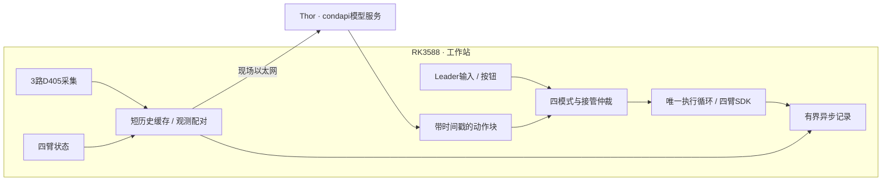

# YAM 双臂工作站

面向 **2 台官方 YAM Leader、2 台标准平行夹爪 Follower、3 台 RealSense D405** 的遥操作、推理、DAgger/HIL 和数据采集工作站。

**Thor 在现场运行模型，RK3588 通过网线与它连接，负责采集、接管、机械臂控制和记录。** 模型训练、微调和 Thor 模型服务归 `condapi` 项目；本仓库负责机械臂侧的运行链路。

设备与采集平台已部署到RK3588。三台D405、四臂零重力、双臂遥操作、遥操作不断臂切换采集、
手柄分段录制与三路MPP短集完整性均经过现场测试；长时采集、急停/恢复全流程和Thor真实策略链路
仍需验收。开发可先从模拟模式开始。

## 数据集工作台

```bash
uv run --no-sync python -m yam_abc_reproduce.dataset_workbench.web --port 8767
```

打开 [数据集清洗与转换](http://127.0.0.1:8767/)：导入 YAM 原始或 LeRobot v3.0 数据、格式筛选、三路逐帧审阅、完整性检查、失败归类、集合合并、逐集移除/恢复，原始转换 LeRobot v3.0，以及携带审核/集合的打包迁移。与采集独立运行。详见 [中文操作手册](docs/dataset_workbench.md)。

迁移到新机器可用独立环境启动：`uv run --locked --script scripts/dataset_workbench.py --catalog /data/yam_catalog`，无需机械臂 SDK 或 Torch。

## 四种模式

| 模式 | Follower 动作来源 | Leader 行为 |
|---|---|---|
| 遥操作 `teleop` | 人工输入 | 重力补偿，读取关节与扳机 |
| 推理 `inference` | Thor 策略 | 不参与控制，不镜像 |
| DAgger/HIL `hil` | 策略与人工本地切换 | 策略时受限镜像，接管时重力补偿 |
| 数据采集 `collect` | 人工输入，手动分段录制 | 重力补偿；①开始/结束，②放弃 |

HIL 通过键盘 `i` 冻结并介入，人工阶段通过手柄①交还模型，不靠握持或力矩猜测。默认双臂一起切换；切换时废弃旧请求和动作缓冲，交还策略时重新取观测推理。推理使用**非RTC单在途异步预取**：执行有效动作时后台向Thor请求最新观测的新块，按本机观测时刻和模型`action_dt`裁掉过期前缀；可选同目标时刻短窗口平滑或temporal ensembling，夹爪采用最新预测。`--baseline`保留普通分块基准，不要求模型修改。
正常约每10个30Hz动作重新请求，并按缓冲剩余时间、观测到动作可用p95和安全余量动态提前；控制循环不等网络。推理/自动运动按1.5rad/s目标变化包络执行，人工遥操作不受该包络限制。三相机本地打包短测、condapi协议及真实Thor测量见[验收](docs/acceptance.md)和[接口](docs/condapi_interface.md#推理周期与产物)。

## 五分钟体验

已有本仓库和环境时，在仓库根目录执行：

```bash
uv sync --locked --extra camera --extra gui --extra deploy
uv run --no-sync yam-workstation --mock --mode collect --check
uv run --no-sync yam-workstation --mock --mode collect --web-port 8766
```

打开 [本机工作站界面](http://127.0.0.1:8766)。纯遥操作无需任务或相机，连接机械臂后明确点击开始。
正式采集可先选任务并连接相机、机械臂；也可在无任务遥操作暂停保持后连接相机、首次选任务、
切换采集并点击开始，四臂无需断开。模拟模式不打开真实机械臂、相机或 Thor。

若 `uv` 不在 PATH，本机路径是 `/home/wuyan-lyj/.local/bin/uv`；虚拟环境位于项目的 `.venv/`。

自动演示策略 → 人工 → 恢复，并连续录制：

```bash
uv run --no-sync yam-workstation --mock --demo --duration 4
```

| 操作 | 终端 | 手柄 |
|---|---|---|
| 选择遥操作 / 推理 / HIL / 采集 | `1` / `2` / `3` / `4` | — |
| 开始或从暂停恢复 | `s` | — |
| HIL 冻结并介入 | 单击 `i` | — |
| HIL 人工阶段交还模型 | 界面 | 任一 Leader 按钮① |
| 采集开始 / 结束一段 | `r` | 按钮①（采集模式遥操作中） |
| 放弃当前采集集 | `x` | 按钮②（仅采集模式） |
| 暂停运动 | 空格 | — |
| 标记成功 / 失败 | `g` / `f` | — |
| 结束会话 | `q` | — |

遥操作/推理模式的手柄按钮无功能。模式切换先保持并结束上一段。遥操作不创建训练集；推理/HIL
在明确开始后记录，采集仅由录制操作分段保存。完整操作与故障行为见 [使用教程](docs/hil_quickstart.md)。

## 采集专员工作台

- **悟演智能采集工作台**：单屏界面，遥操作可无任务直接连接；采集任务包含中文显示名和英文task，
  相机与机械臂独立连接，三路预览、录制/弃集、结果和健康状态按当前模式显示。
- **设备与调试**：四臂连接状态、Follower关节/夹爪点动、保存准备位、回准备位、重力补偿。
- **恢复流程**：紧急暂停锁存 → 检查现场 → 解除锁存（仍保持）→ 选择开始、回位或重力补偿。
- **预览隔离**：最多5Hz、480×360；独立低优先级进程做JPEG编码，单槽共享内存，只取最新画面。关闭预览会停止预览编码，原始录制继续。

完整操作与限制见 [运行手册](docs/hil_quickstart.md)。软件紧急暂停不能替代物理急停；回位是关节插值，没有碰撞规划，真实路径必须现场核验。

## 安装和设备配置

首次克隆后初始化所有子模块，再安装轻量客户端环境：

```bash
git clone --recurse-submodules ssh://git@192.168.110.142:2222/wuyan_lyj/YAM.git
cd YAM
scripts/apply_i2rt_safety_patches.sh
uv python install 3.12.14
uv sync --locked --extra camera --extra gui --extra deploy
```

需要 C++ 编译工具等系统依赖，详见 [环境安装与国内镜像](docs/environment.md)。清华 PyPI 镜像已经配置；它不加速 Git 子模块、Python 安装器和模型下载。不需要在 RK3588 安装模型训练后端。

当前IPC专用配置为 [configs/station_hil.yaml](configs/station_hil.yaml)：两只标准DM4310夹爪的
`linear_4310`类型与实测行程、四路CAN角色、三台D405序列号及视角已经登记。迁移到新设备时
重新核对这些设备身份和夹爪行程；推理/HIL启用前还须核对Thor任务prompt及与模型训练一致的
动作采样间隔`action_dt`。

[硬件事实与初始化顺序](docs/workstation.md)是设备信息的规范入口。主仓库仅使用 `third_party/i2rt` SDK 子模块，不需要同级 `i2rt` 目录。

使用 `--web-port` 打开工作台时尚不构造设备；点击“连接机械臂”后就可能施加力矩、校准夹爪，**不是点击“开始”才上电**。部署必须先运行 `scripts/apply_i2rt_safety_patches.sh`；缺少线性夹爪多圈编码器安全补丁时程序会在打开CAN前拒绝连接。不带界面的CLI仍在启动时连接。退出会结束 SDK 控制并可能撤掉力矩，先支撑机械臂；软件保持不替代硬件急停。不默认清零、不运行 GELLO 校准；“回准备位”使用本机示教保存的四臂姿态，需操作员明确发起。

## 运行架构



D405 不支持三机外部硬件同步。本版采用主机接收时间配对、关节历史插值和质量指标；小偏差告警，持续过期才保持。常驻`yam-device`独占控制、相机、推理和录制，`yam-workstation` Web/API可单独重启；没有引入ROS2。

当前是相机采集线程、工作站内控制循环、网络线程与独立预览/录制编码进程，**不是硬实时或曝光同步保证**。IPC双臂运动对照发现将控制限定为两个大核会明显变卡，正式服务维持已验证的4–7号掩码。模型协议见 [condapi 接口](docs/condapi_interface.md)，接管机制见 [当前架构](docs/dagger_architecture.md)，性能取舍见 [同步设计](docs/synchronization_design.md)。

## 数据与专家导出

采集示范：`uv run --no-sync yam-workstation --mock --mode collect --web-port 8766`。选任务、连接相机和机械臂、明确开始控制，再用页面/手柄①录制与结束；②放弃当前集而不暂停遥操作，空格才暂停运动。也可沿用无任务遥操作的已连接四臂：先保持、连接相机、首次绑定任务，再切采集并开始。详见 [数据采集手册](docs/collect.md)。

每次连接创建一个会话；每集采用 **MP4＋HDF5＋JSON清单**，默认60秒一个物理分段，同一长任务仍是一集：

```text
会话/
├── session.json
└── episode_000001/
    ├── manifest.json
    ├── segment_000000/        # samples.h5、三路MP4、segment.json
    └── segment_000001/
```

主要数值分批写HDF5；图像通过固定共享缓冲交给独立编码进程。录制队列允许短时积压，结束后继续排空保存；若持续写入速度低于采集速度，有限内存仍可能耗尽并明确报错，不能把短集通过视为无限长完整性。录制错误标为aborted，旧JSONL集继续可读。工作台和无界面CLI都只采集，不自动转换；原始会话可上传服务器后显式生成LeRobot v3.0。

```bash
uv run --locked --script scripts/convert_lerobot.py /data/raw/yam --output /data/lerobot/batch_001
```

脚本有独立依赖锁，不安装机械臂、相机或模型环境；支持单集、会话及多会话目录。

恢复工具保留来源、另写恢复目录，恢复数据必须审核后明确允许导出。字段、恢复和专家筛选见 [数据格式](docs/convert.md)。

## 验证与完成范围

| 状态 | 范围 |
|---|---|
| 已实现、离线验证 | 四模式、接管仲裁、非RTC异步动作缓冲与可选同目标时刻融合、同步配对、原始记录与显式转换、双平台界面 |
| 现场短测通过 | 三D405、四臂与夹爪、双臂遥操作、同会话遥操作→采集、手柄开/停/弃集、902步三路MPP/HDF5逐项回读 |
| 待现场验收 | 长时录制队列斜率与完整性、录制中运动延迟、急停/恢复全流程、Thor模型契约与任务效果 |
| 暂不引入 | RTC、模型侧前缀条件、曝光时钟校准 |

当前验收及限制见 [验收记录](docs/acceptance.md)；2026-09-15短集与按钮的归因边界见
[现场记录](docs/workstation.md#2026-09-15-右-leader-间歇无应答与手柄按钮部分实测)。

```bash
uv run --no-sync pytest -q
python3 scripts/check_project_memory.py
```

## 文档与项目记忆

| 任务 | 入口 |
|---|---|
| 开始使用 / 真机前配置 | [第一版教程](docs/hil_quickstart.md) |
| 环境 / 国内镜像 / Git | [环境](docs/environment.md) |
| 硬件事实 / 初始化 | [工作站](docs/workstation.md) |
| 模式 / 接管 / 生命周期 | [架构](docs/dagger_architecture.md) |
| 相机 / 多臂同步 / 性能 | [同步设计](docs/synchronization_design.md) |
| 模型接口 / condapi 参考 | [接口约束](docs/condapi_interface.md) |
| 后续接手 | [记忆路由](docs/cache/context_index.md) → [续作检查点](docs/cache/checkpoint.md) |
| 维护记忆 | [记忆规则](docs/memory.md) |
| 旧 GUI / 上游训练与工具 | [保留工具说明](docs/legacy_tools.md) |

记忆存于Git内的owner文档、依赖指纹和验收证据，不依赖外部记忆服务。稳定事实各有一个规范所有者，摘要只做投影。热入口仍遵守[记忆规则](docs/memory.md)的字节预算；完整owner与证据按需读取，不设累计检索额度，也不把写检查点称为自动压缩。

## 目录

```text
configs/station_hil.yaml           当前设备模板与运行阈值
yam_abc_reproduce/hil/             四模式、推理、配对、录制、界面、导出
yam_abc_reproduce/robot/           硬件边界与模拟设备
yam_abc_reproduce/camera/          相机驱动与采集线程
third_party/i2rt/                 固定版本机械臂SDK
docs/cache/                      记忆路由、摘要、检查点、经验记录
docs/evidence/                   历史验证与来源指纹
tests/                           离线验证
```

Git 跟踪 `pyproject.toml`、`uv.lock` 和 `.python-version`；不提交 `.venv/`、数据、模型或运行时 ledger。

## 来源与许可证

本项目基于 [i2rt-robotics/yam-abc-reproduce](https://github.com/i2rt-robotics/yam-abc-reproduce)，保留上游历史与工具。Evo-RL、Kai0 和 Diffusion Policy / UMI 的参考范围见 [源码参考记录](docs/reference_sources.md)。各子模块和外部项目遵循各自许可证；主仓库见 [LICENSE](LICENSE)。
