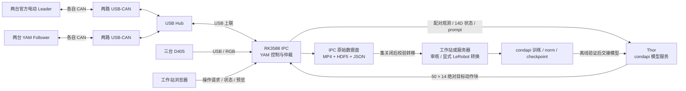
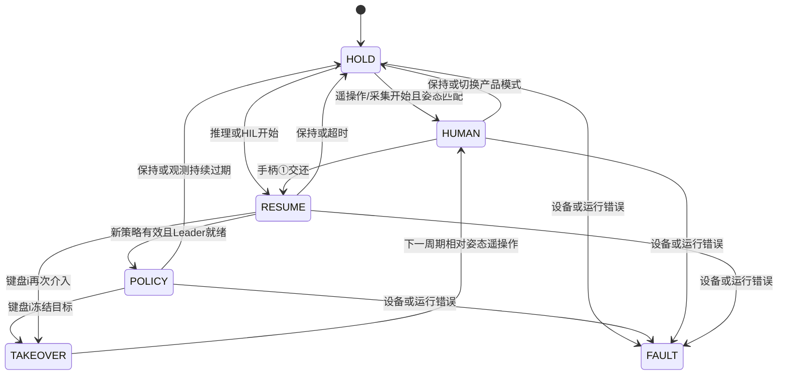

# 四模式工作站架构

本文持有系统架构及实施交接基线。2026-09-14 用户确认硬件到齐，要求先固定设计与记忆，再由其他 agent 实施；本次只做本地文档和源码核查。下列基线是后续实施约束，未实现部分明确标注，不能据此宣称设备已联调。操作步骤由 [使用教程](hil_quickstart.md)维护，性能和同步策略由 [同步设计](synchronization_design.md)维护。

## 产品交付原则（2026-09-14）

用户确认P0与接线已完成；项目进入以实际使用和持续维护为目标的产品开发阶段。设备/模型分工保留v1，P0–P8是实施顺序，以下三条约束决定后续需求、设计、评审与验收。

### 完整可靠，复杂度与实际问题相称

系统要覆盖准备、运行、停止、保存、失败说明和恢复的完整流程。可靠性落实在已有职责边界：硬件由单一控制者写入，外部设备/模型输入核对合同，录制有界且保存状态真实，原始数据不被离线整理覆盖，错误有可定位原因和可执行的下一步。

检查放在数据或状态进入系统、跨设备/进程/存储边界的位置；内部已满足合同的调用不层层重复防御。不为假想场景增加通用插件框架、重复状态机、无条件重试、静默fallback或第二套数据层。增加队列、进程、兼容分支、保护逻辑前，说明它解决的用户问题或已观察故障、现有边界为何不足、如何验证；没有这些依据就用现有最小机制完成需求。这里的简化不删除必要的动作单位/时效校验、设备独占或原始数据保护。

P0的身份/接线确认可复用，不因缺少非必要本体S/N或Hub型号重复阻断开工。只有接线/设备/驱动变化、映射异常或当前动作确实依赖的状态变化时复查对应项。P0完成不代表已完成CAN通讯、相机流和运动验收；这些检查各在P2/P3执行一次并记录其适用范围。

### 围绕两个平台维护用户流程

| 交付产品 | 主要用户流程与成功结果 | 维护边界与所有者 |
|---|---|---|
| **设备与采集平台**（原采集平台） | 操作员查看/连接设备→初始化与调试→维护/准备→选择任务及四模式运行→采集/接管→保存或放弃→查看结果/故障与恢复指引 | 用户已提供设备本体调试界面，沿现有界面整合日常流程；复用单一Runtime与四模式，初始化/维护为互斥状态。操作与自动记录归 [运行手册](hil_quickstart.md)，采集归 [采集手册](collect.md) |
| 数据集平台 | 数据整理者导入已结束的数据→定位/预览→检查与审核→分类/集合→显式转换/导出/迁移→核对产物、来源和失败原因 | 复用现有独立工作台；整理不依赖机械臂在线，检查/转换不进入控制循环，审核与源数据分开。行为及边界归 [数据集工作台](dataset_workbench.md) |

两平台通过任务/episode身份、原始数据清单、审核与转换报告连接；物理进程/部署位置服从资源边界，不因为是两个产品就复制公共合同或模型/控制逻辑。页面上的术语、保存/失败状态和任务身份需一致，技术细节进入按需诊断而非占据日常主流程。两平台都作为长期交付面维护，新增推理能力不能让既有调试、采集或数据整理退化。

每次需求先写清用户、要完成的任务、成功/失败时可见的结果及验收路径，再决定内部模块。扩展新功能优先放入适合的既有流程；确有不同用户或独立生命周期才增加交付面。未来产品先保留扩展边界，不预建用户尚不需要的通用框架。

验收按改动影响选择：采集改动验证设备状态、录制保存/放弃与恢复；数据集改动验证导入、定位、审核和目标导出；公共任务/数据合同变化时补两平台之间的实际产物回读。界面变更覆盖主要用户路径和有依据的失败路径，相关检查通过后不无理由扩大为全栈重跑。mock、目标IPC实测、任务效果分别报告。

### 局域网访问与跨平台交付

两个平台都以浏览器为交付客户端，正式部署须在局域网通过服务机器IP/主机名及端口直接访问；不要求每个使用者装Python、SDK或配置SSH隧道。Windows/macOS/Linux桌面浏览器是首轮验收范围；平板等触控终端如要承诺支持，另验证尺寸与输入，不把网页能打开等同所有终端可操作。

| 服务 | 约定端口 / 所属机器 | 交付要求 |
|---|---|---|
| 设备与采集平台 | IPC的8766，可配置 | 局域网设备查看/初始化/调试/维护/采集；页面、API、事件/预览连接均指向IPC服务，不硬编码客户端localhost |
| 数据集平台 | 运行整理服务的工作站或服务器8767，可配置 | 同网段浏览器导入/检索/审阅/显式导出；数据路径属于服务机器，界面说明该语义，不能把客户端本地目录当服务器目录 |
| Thor policy | Thor的8000，可配置 | 仍是IPC→Thor推理接口，浏览器不绕过IPC直接驱动模型动作 |

部署需提供监听地址和允许主机配置，正式实例绑定目标LAN地址（或明确配置的0.0.0.0），主机防火墙/容器端口对目标局域网放通，交付实际可点击URL和复跑方式。Host/Origin检查按声明的LAN IP/主机名配置，不能只改监听或以无条件关闭检查代替部署。无需公网开放、云登录或为LAN访问另建通用网关。

设备与采集平台已支持显式`--web-host`和附加Host白名单，IPC正式实例绑定
`192.168.110.140:8766`，仍执行同源控制检查；通配监听必须同时提供显式允许Host。数据集平台
仍绑定本机，8767的LAN部署和两平台跨操作系统验收尚未完成。旧SSH转发说明只属于临时开发方式。

跨平台验收从另一台LAN设备开始：两页面能访问、主要API/预览/进度可用，设备与采集平台完成受控的日常操作，数据平台完成实际小集回读/审核/导出。至少记录两个桌面OS/浏览器组合、服务版本和URL。多个浏览器访问时明确只读/操作会话，保持单一电机会话；旁观页关闭不应误停操作员，实际操作端失联按既有保持规则处理，重连不自动恢复运动。会话规则在控制入口解决，不增加多套控制状态机。

### 分层记忆支撑持续交付

热记忆只保留产品原则、不可违反的边界和路由；当前进度只保留活动目标/最近结果/阻断/下一步。设备身份、安装步骤、页面细节、测试记录和旧方案分别回到owner与冷资料，新增结果先更新owner再投影。文件预算、晋升/降级和按需检索规则由 [记忆维护](memory.md#热记忆预算与降级规则) 持有；不在本页复制另一套记忆方法。

## 2026-09-14 架构基线 v1

### 部署边界

**两台运行设备：RK3588 IPC + Thor。** 本次登记的 IPC 就是 RK3588 底层主机，不另设第三台中转控制器。开发工作站用于管理、浏览器操作与离线数据处理，训练服务器用于训练；两者均不进入逐帧推理执行链路。

| 节点 / 项目所有者 | 固定职责 | 部署事实与验收所有者 |
|---|---|---|
| RK3588 IPC / 本 YAM 仓库 | 四臂 SDK/CAN、三路相机、观测配对、四模式仲裁、目标提交、原始记录、采集 Web 后端 | [硬件身份](workstation.md)、[环境](environment.md)、[验收](acceptance.md) |
| Thor / condapi | 模型输入变换、norm、推理、动作还原；服务生命周期、模型/engine 身份及回放证据 | condapi模型owner与本库[接口快照](condapi_interface.md) |
| 开发工作站 / YAM 工具 | 代码管理、浏览器、数据集工作台、审核、显式转换、校验传输 | [数据集工作台](dataset_workbench.md)、[环境](environment.md) |
| 训练服务器 / condapi | 数据版本审计、专家筛选、norm、训练、checkpoint 交接 | condapi训练owner；不作为采集或推理在线依赖 |

RK 采集环境使用 uv / Python 3.12；不安装模型训练栈作为采集前提。Thor 沿用 condapi 的 Pi 系列容器；一个系列服务一次加载一个核验过的模型。i2rt 仍使用本项目固定子模块；不迁入 condapi 控制代码，也不新写第二套机械臂 SDK。

### 接线、网络与存储

1. **四臂经用户的hub接IPC，复用已完成身份登记。** 两follower、两官方电动leader；P0结果见 [设备身份表](workstation.md#第一步设备身份登记-p0)。用户已确认USB Hub连接各机械臂USB-CAN接口；运行时锁定的是各臂所接的固定 USB-Hub 下联口，不要求机械臂本体S/N，适配器S/N仅作审计交叉核对。固定下联口到四个逻辑角色的映射归硬件owner；Hub型号非开工阻断，实际CAN通讯在P3验收，板载 `bcan0`～`bcan3` 仅是已枚举资源，不作为默认接臂方案。CAN仍需每臂独立逻辑通道；USB Hub可以共享USB上联，但不能据此把各臂并为同一CAN总线。不得按枚举顺序猜左右/主从。
2. **D405 接 IPC 的 USB。** 固定 top/left/right 角色与序列号，联调时确认安装视角、RGB 通道和 USB 拓扑。初始配置为三路 RGB 640×480、30 fps；深度不进入 v1 policy 合同。相机使用软件时间配对，具体时间与容差归 [同步设计](synchronization_design.md)。
3. **生产数据走 RK↔Thor 独立网线。** 当前 `lan1=192.168.250.2/24` 接的是开发机 `.1`，只证明管理链路。v1 计划复用 `lan1` 直连 Thor，保留 RK `.2`，Thor `.3` 为预留地址，需查冲突并在 Thor 侧绑定实际网卡；两端不设网关/DNS。改接后开发机通过已有管理网进入，不再宣称原 `.1↔.2` 直连仍存在；若增加有线管理口，使用另一个子网，不给两个独立物理口套同一网段。
4. **管理与生产分开。** Wi-Fi/USB 管理路径不作为策略数据的自动后备路由；v1 不依赖桥接、NAT、PTP 或互联网。模型服务默认端口 8000 是部署约定，实际 IP/网卡/监听/容器映射必须登记并从 RK 验证；限制在现场管理与推理网络，不以监听成功代替推理通过。
5. **原始数据优先写 IPC NVMe。** NVMe已完成挂载与项目迁移，实际路径/UUID由环境owner持有，不重复初始化。现有 `save_root: data/episodes` 是开发配置，仍需明确生产绝对数据路径、权限与空闲空间；不因本规划格式化磁盘。录制前验证实际落在目标盘，挂载缺失不能静默回落 eMMC。
6. **转换和训练离线进行。** 原始集关闭并写清单后才纳入校验传输；目标端核对文件清单/哈希和可回读性，源数据保留。数据集工作台、批量转换、归档/迁移部署在工作站或服务器，首轮真机采集不在 IPC 同时跑这些磁盘重任务。暂不增加同步守护进程或自动训练触发器。

### 运行与失败处理约束

- `Runtime` 是四臂上层命令的唯一写入者；Web、相机、推理、录制和维护请求都经本地仲裁。控制线程不等待 Thor、视频编码、HTTP 或转换。启动工作台后保持未连接；真实设备连接本身可能施加力矩。
- 初始上层控制频率 **30 Hz**，动作 `action_dt` 暂配 **1/30 s**；这是配置基线，后者必须与训练数据的时间语义核对。SDK 内部电机循环频率另行测量，PREEMPT_RT 内核不等于 Python 控制链路已获硬实时保证。
- 非 RTC、单在途推理、旧块有效期间异步重规划；epoch、请求身份、观测参考时刻与动作有效期由 RK 保管。切换模式、接管、暂停、故障或模型会话变化必须废弃旧结果；不自动重连后恢复运动。
- 相机短时无有效配对可消耗有效动作块，持续过期进入保持；策略非法/超时不得继续延长旧动作寿命。SDK 状态失效、严重控制超时及设备异常进入故障；现场恢复步骤归运行手册。
- 录制队列满、编码器退出、磁盘不足不得静默丢训练帧并报保存成功。已有错误上报与 aborted 路径需在 IPC 验收；控制侧必须尽快保持/故障，回收、封装和诊断在后台。允许丢弃的预览帧与训练记录分开处理。
- 四臂设备的**跨进程独占锁尚未实现**，列为正式多入口部署前的补齐项。此前逐次核查仅有一个电机会话；同一进程有线程锁不能替代跨入口所有权。软件保持/心跳与真实硬件停止手段分别验收。

### 后续 agent 工作包与依赖

用户最新顺序：**先做P0四臂USB-CAN下联口与三相机身份识别，再做部署与运行联调。** 以下为任务边界，未创建或启动 agent。各 agent 先读 `AGENTS.md`、本节，再只读本包所有者；不要重构已冻结的四模式。软件修改在所属仓库提交，现场操作需要独立核验现场条件。

| 包 | 所属 / 范围 | 输入与依赖 | 完成交付与闸门 |
|---|---|---|---|
| **P0 身份登记（已完成）** | YAM：识别USB Hub及四臂所接USB-CAN下联口、三相机序列号和角色 | 已登记IPC；设备接入条件。只读枚举，必要的最小枚举工具独立说明，不先部署完整控制栈 | 交付4臂＋3相机身份表、hub拓扑、稳定标识、未识别项与原始证据；不启用电机 |
| P1 IPC 部署 | YAM：Python 3.12/uv、Gitea checkout/子模块、ARM64 依赖、数据盘路径 | P0；复核当前网络/磁盘与厂商服务占用 | 锁定环境、模块实际导入、mock 四模式及录制回读；目标盘不回落；部署报告，不连接电机 |
| P2 相机 | YAM：用P0序列号绑定三路D405、采集参数与时间戳 | P0 + P1；三相机实物 | 真实 RGB 短录制，检查帧数/索引/颜色/配对偏差/队列；相机可独立连接，不构造机器人 |
| P3 四臂 | YAM：用P0的hub/通信适配器映射核验CAN兼容性、夹爪型号、设备独占、已有零位/方向/按钮 | P0 + P1；现场安装与停止手段核验 | 先单臂、单对、再双对；低幅遥操作/暂停/维护互斥证据；最终 station 配置与实测单位/范围 |
| P4 模型服务 | condapi：选本次 checkpoint/norm，复用 W 路线，提供真实普通 WebSocket policy 服务及 metadata | 可与 P1–P3 独立推进；本次模型来源和代表回放 | JAX/转换/engine 证据、服务可复跑命令、同 checkpoint 的合同清单与真实服务回放；基础模型仅用于无运动探针 |
| P5 原始采集 | YAM：任务、四臂遥操作、三路录制、按钮、审核/转换 | P2 + P3 | 多集真实 MP4/HDF5/JSON 回读；显式转换后 condapi 读取三路/14D/英文 task；完成数据单位与动作时间对齐审计 |
| P6 双机接口 | YAM 客户端 + condapi 服务，各改自己的仓库 | P1 + P4；真实观测来自 P2 或已审计冻结样本 | 先无电机跨网探针，再接只记录输出的影子路径；补齐模型合同校验、断连/迟到/错版本测试。探针现有，影子执行禁写与自动合同 gate 待实现 |
| P7 推理/HIL 联调 | YAM 控制侧；condapi 提供已核验模型 | P3 + P5 + P6；同一合同所有阻断项关闭 | 先受控纯推理，再 HIL 键盘介入/相对遥操作/手柄①交还；任务指标与人工审核、原始策略/提交/反馈/事件完整证据 |
| P8 连续运行 | YAM 主责、condapi 协作 | 对应短测通过 | 真实三路采集与闭环分别至少 1 小时，预览开关对照、资源/温度/队列/控制时延/恢复报告；不把 mock 长时等同真机 |

P0已完成，不重复作为当前第一步；P4继续提供模型与服务交付。P2 和 P3 可由不同 agent 准备配置，但共用 IPC 的电机/采集验收应安排独占时段，P8 期间不安装依赖或跑转换。P4 不以等待 RK 安装为前提；P5 可在 Thor 尚未交付模型时完成，先建立可靠示范采集链路。P6 的端口/形状通过不放行 P7。

每包交付：代码 commit 与未提交差异指纹、实际设备/环境/config 身份、命令与退出状态、证据文件、已通过范围、未决项和下一包输入。硬件事实写 [workstation](workstation.md)，依赖写 [environment](environment.md)，合同写 [condapi_interface](condapi_interface.md)，验收写 [acceptance](acceptance.md)；kernel 只投影，checkpoint 只更新当前交接。

### 开工状态与变更规则

架构职责、四模式、单一控制写入、非RTC协议及原始数据/离线转换边界按v1保留，产品原则与LAN交付要求按本页追加约束执行。身份/部署进度归各自owner；模型身份、单位、`action_dt`及运行阈值按当前缺口核验，不能用设计默认值填实测。阈值在对应测试前登记，保留 p50/p95/p99、极值和失败记录，不从历史 104 ms 或试验结果倒推通过标准。

允许实施 agent 在本包内补实现和配置；若改变节点职责、动作语义、协议/时钟基准、产品模式或数据格式，先修订本基线及模型契约并说明影响，再跨仓库实现。本轮架构整理未作实机运动、远端部署、训练或在线模型切换；其他任务已有成果以相应owner/证据为准。

本轮事实来源、代码检查范围和记忆冲突记录见 [架构核查证据](evidence/20260914-architecture-audit.json)，其后用户确认USB Hub/USB-CAN接法及身份登记优先级，见 [追加约束](evidence/20260914-hub-inventory-steering.json)；接线方案按本节最新说明执行。condapi 的模型事实保留在其原所有者，本仓库只保存带版本的读取快照。

## 职责

- 本项目：RK3588 的设备生命周期、采集、观测配对、动作仲裁、执行与原始记录；独立导出工具在工作站/服务器离线运行。
- condapi：模型训练、微调、转换和 Thor 本地模型服务。
- Thor 与 RK3588：现场以太网连接；不依赖云端推理。
- i2rt：底层驱动与重力补偿，固定在 `third_party/i2rt`；不另建第二套 SDK。

## 产品模式与内部状态

| 产品模式 | 动作来源 | Leader 行为 |
|---|---|---|
| teleop：遥操作 | 人工 | 重力补偿 |
| inference：推理 | 策略 | 不镜像，不参与动作决策 |
| hil：DAgger/HIL | 本地切换策略/人工 | 策略时镜像，人工时重力补偿 |
| collect：数据采集 | 人工示范，手动分段 | 重力补偿，顶部按钮开关录制 |

HOLD、TAKEOVER、RESUME、POLICY、HUMAN、FAULT 是内部状态，不再扩展成用户需要选择的产品模式。

交接姿态不匹配时留在/进入 HOLD。FAULT 不自动重试运动，需退出并重建会话。

## 单一控制拥有者

`Runtime.run()` 是本会话四臂命令的唯一上层拥有者。相机采集、网络推理、视频编码和 Web 控件不会直接驱动机械臂。i2rt 的各臂底层线程继续运行。

一次循环执行：读取状态与按钮 → 更新历史和观测 → 选择本地事件 → 仲裁策略/人工/保持 → 限幅 → 向 SDK 提交四臂目标 → 异步记录。

同一 tick 不等于四条 CAN 总线同时执行。记录各臂提交时间和状态年龄，保留可测的软件协调语义。禁止同时启动旧 GUI 的电机会话；当前尚无跨新旧入口的统一设备锁。

## 接管与恢复

1. HIL模型执行期间Leader随Follower运动。键盘 `i` 通过独立有界高优先级通道介入，不排在普通界面命令后面。手柄不负责接管。
2. 当前周期冻结Follower和Leader目标，增加epoch使旧动作块和在途结果失效，记录事件请求和实际提交时刻。
3. 下一周期Leader切重力补偿；按Leader相对于接管瞬间的位移驱动Follower，避免追赶镜像误差。夹爪仍用软接管。
4. 人工阶段手柄①发出交还请求。Follower暂时保持，Leader受限镜像对齐；新观测策略有效且就绪才恢复。
5. HIL全部阶段在一个episode里，冻结/等待标hold，人工标human；干预编号和阶段事件进入LeRobot附加字段。键盘空格单独暂停，两个手柄都不承担全局停止。

## 模块映射

路径均相对 `yam_abc_reproduce/`。

| 模块 | 当前职责 |
|---|---|
| `hil/run.py` | 入口、运行循环、输入事件、统计、资源装配 |
| `hil/core.py` | 四模式状态机、交接、epoch、动作块与时效 |
| `hil/session.py` | 本地事件优先于同 tick 策略结果，提交/接收推理 |
| `hil/policy.py` | 单在途工作线程与 OpenPI WebSocket 协议 |
| `hil/station.py` | 四臂 IO、限位、Leader 模式与 SDK 提交 |
| `robot/yam_adapter.py` | i2rt 边界、官方 Leader 增益/重力补偿 |
| `camera/worker.py`、`hil/observation.py` | 相机短历史、接收时间配对、状态插值 |
| `hil/recording.py`、`hil/export.py` | 有界片段管理/视频记录、连续专家段导出 |
| `hil/buttons.py` | 左右官方 Leader 按键边沿、持续保持和模式主操作 |
| `hil/keyboard.py`、`hil/web.py` | 终端/本机网页输入 |

`hil/snapshots.py` 是早期独立帧缓冲原型，仍有单元测试，当前 Runtime 使用 `hil/observation.py`。

## 推理与记录

默认非 RTC 异步重规划：执行有效旧块期间请求新块；按观测参考时间和 `action_dt` 裁掉过期前缀。当前不做动作块融合或时间集成。`--baseline` 保留不预取分块用于比较。

输出严格为有限的 50×14 绝对动作，模型契约见 [condapi 接口](condapi_interface.md)。限幅约束的是提交目标相对当前姿态的步长，不是实际速度或碰撞安全保证。

记录保留原始策略块、当前策略建议、人工输入、选中动作、最终提交命令和测量状态。提交到 SDK 不代表机械臂已到达。策略缺失为null，并有有效性掩码；默认LeRobot保留完整HIL阶段，另有可选专家筛选。

## 已验证与未验证

[第一版证据](evidence/20260908-hil-runtime-v1.json)覆盖历史三模式、网络迟到、模式切换、协议往返、驱动替身、视频长度和专家段拆分。没有真实四臂或 Thor/RK3588 性能结论。

当前优先补可靠性和现场诊断；录制/预览已采用独立进程。进一步进程拆分、C++ 执行器和曝光时钟标定按实测需要引入，不作为第一版前提。

## 第四模式：数据采集

`collect` 复用遥操作的 HUMAN 控制，不请求模型。`RecordingSession` 在有界后台队列中处理 episode 开始、帧和结束，视频封装不在控制循环。其余模式持续记录，模式切换切开 episode；采集模式由操作者显式分段，未录制时不保存逐帧数据。人工采集是 `source=human`、`is_intervention=false`，HIL 人工接管才标记干预。按钮①开始/结束，②放弃当前集；两者不暂停遥操作。具体映射见 [采集手册](collect.md)。

## 性能与格式整理

控制循环只提交到有界录制队列；独立进程编码与分段HDF5记录，通过固定共享图像缓冲传递。每路编码器单线程，避免三个编码器自行扩张线程数。状态面板低频更新最近300样本的分阶段p50/p95/p99，记录队列峰值与编码耗时。采集程序不执行格式转换；本机或服务器显式运行独立脚本，批量Parquet/流式图像写入，不依赖RK上的PyTorch。真实性能需现场测量，见 [验收](acceptance.md)。

## 操作工作台与维护控制

`hil/workbench.py` 管理未连接→连接中→运行→关闭→离线整理的生命周期；HTTP线程只提交指令。`hil/maintenance.py` 在Runtime内处理软件锁存、解除后保持、示教准备位回位、重力补偿；与策略/遥操作互斥，不另建第五种任务模式。点动由 `hil/jog.py` 提交有限目标，同一控制线程写设备。

预览通过 `hil/preview.py` 的单槽共享内存传给独立低优先级编码进程；最多5Hz、480×360，满则丢预览。独立心跳监测不依赖预览编码或磁盘查询。页面关闭超过3秒请求hold；这不是硬件故障保护。

真实SDK异常仍需退出并现场排查；只有操作员软件暂停的锁存允许网页解除，解除后保持且旧策略无效。回位期间不采训练数据；准备位保存与station哈希绑定，不提供编码器清零操作。详细流程归运行手册所有。
