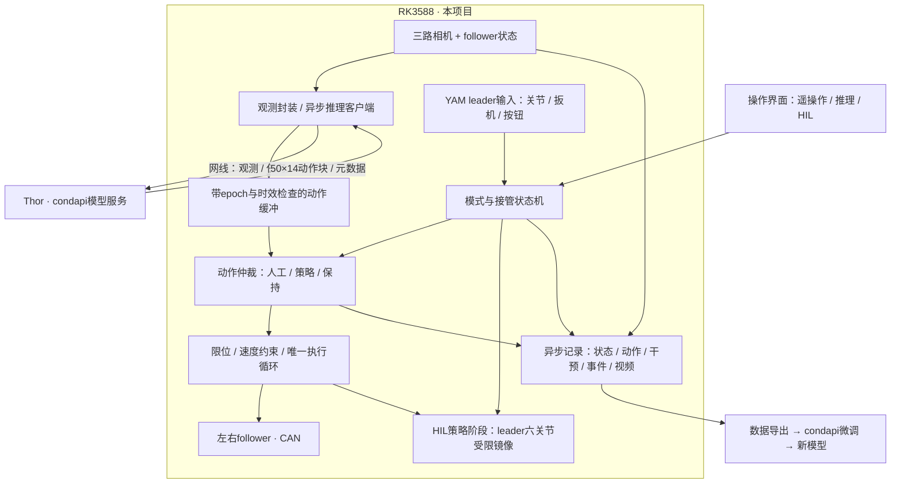

# YAM 三模式架构与 HIL 接管（第一版实施方案）

## 最新补充

用户进一步明确现场本地边缘推理、Kai0非RTC优化与成熟同步架构。
以 [同步与优化设计](synchronization_design.md) 为这些问题的最新规范：无预取路径保留为已测基准，
目标升级为带时间戳的非RTC异步重规划；不把基准限制写成最终架构限制。

## 三种产品模式

| 模式 | follower动作来源 | leader行为 | 推理与记录 |
|---|---|---|---|
| 遥操作 | 人工leader | 重力补偿、读取输入 | 不需Thor，记录示范 |
| 推理 | Thor策略 | 不参与控制、稳定停放 | 记录rollout，可选 |
| DAgger/HIL | 本地仲裁的策略或人工 | 策略阶段镜像，人工阶段重力补偿 | 连续记录执行动作及干预标签 |

模式由UI选择；只有HIL内部有POLICY/HUMAN/RESUME等阶段。
控制核心、网络客户端和软件帧配对已实现并离线测试；四臂驱动、GUI与完整录制链路尚未接入。

## HIL接管提案

第一版按双臂一起接管实施；左右独立接管不在第一版范围。
建议顶部按钮单击切入人工，再次单击申请恢复策略；不是松手立即恢复。
按钮事件在RK3588本地处理，第一版不依赖力矩阈值猜测用户是否接管。

1. POLICY：follower执行约束后策略动作；leader六关节镜像对应目标，独立限制其增益/速度并监测两臂误差。
2. 接管事件：递增control_epoch、废弃旧chunk及迟到响应；停止leader位置跟随，转重力补偿。
3. 同一控制边界锁存两臂状态，从当前follower状态无跳变衔接人工输入；误差超限先HOLD，不向旧leader姿态强拉。
4. 扳机不可被策略电动镜像；接管时保持当前夹爪目标，扳机先进入目标对应的拾取区再获得绝对控制权（soft takeover提案）。
5. 人工阶段持续记录，不发新的策略请求；已在途结果作废。policy_action 缺失并标 policy_valid=false。
6. 再次按键进入RESUME：废弃干预前队列，使用当前观测重新推理；等待期间保持当前位置，仍可撤销恢复返回人工。
7. 有效新块、姿态误差和leader模式切换检查通过后，限速交还策略；超时进入HOLD，绝不执行旧块。

硬件/通信故障的HOLD/FAULT属于内部状态，不是额外产品模式。
模式间转换先进入受控保持和新epoch，不能复用另一模式残留动作。
接管有效时延应测“物理按钮→最后一条策略命令/第一条人工命令”，不能用UI响应时间替代。

## 目标与边界

2026-09-08 用户确定 yam-abc-reproduce 为唯一主项目；同级 i2rt 已删除，
SDK 仍由本项目 third_party/i2rt 子模块提供。
目标为两台官方电动 YAM leader 与两台 YAM follower 的持续策略执行、随时人工接管、
干预数据采集。Thor 负责边缘模型推理，经以太网连接 RK3588；RK3588 负责机械臂底层控制。
模型推理与微调的规范来源是 /home/wuyan-lyj/condapi，需要有界读取其推理记忆后再确定协议。

## 已审核的当前源码

审查基线：44217502935144312f161b4d0efb6291f95bab3d，未做硬件性能测量。

| 所在文件 | 实际行为 | 对新目标的影响 |
|---|---|---|
| deploy/run.py、gui/session.py | followers_only 构建；部署前释放 leader | 无法在部署过程中直接读 leader 并接管 |
| teleop/loop.py | 独立 ControlLoop，关闭同步后不调用记录 tick | 与策略循环切换会断开统一记录链 |
| deploy/loop.py | 独立 DeployLoop；调用 client.get_action 后发命令 | 同步推理延迟可能阻塞上层控制周期 |
| deploy/client.py | 普通模式在 chunk 边界同步推理；RTC 首包也同步 | 不能让人工接管等待网络请求 |
| deploy/client.py | RTC 异步线程，reset 最多 join 1 秒，没有请求 epoch | 需验证 reset/接管后迟到响应能否污染新动作队列 |
| camera/worker.py | 后台采集、最新帧缓存 | 值得保留；读取本身没有帧龄拒绝机制 |
| data/recorder.py | RGB 逐帧复制进 RAM，结束时编码写盘 | 对 RK3588 内存和结束时延不理想 |
| data/schema.py | follower 状态、执行动作、相机时间戳 | 缺少逐帧干预掩码、原始策略建议及切换事件 |
| robot/yam_adapter.py | 官方 leader 已支持 command_arm 和可调 PD 增益 | 可以复用，但需要显式镜像/人工模式转换 |

以上包内路径均以 yam_abc_reproduce/ 为前缀。
结论：有可复用的驱动/相机/GUI底座；不能在没有 Thor/RK3588 实测的情况下声称性能好，
当前部署生命周期也不满足持续 DAgger。

## Evo-RL 已核实的参考

来源：https://github.com/MINT-SJTU/Evo-RL 。2026-09-08 检索 main 源码，
参考克隆已固定到 6f2db449a21e1bac750b996f2e27cac6739aa63f；后续以此提交源码为准。

- src/lerobot/scripts/lerobot_human_inloop_record.py：策略动作发给 follower，
  同时镜像到 teleop；启用 intervention state machine 和 episode outcome 标签。
- utils/control_utils.py 的默认 intervention_toggle_key 为 `i`，也支持事件接入；不是握住即接管。
- scripts/recording_loop.py 在循环边界处理 toggle：POLICY → ACTIVE；再次触发则 RELEASE，reset policy/pre/postprocessor，重新推理。
- 没有“按键后四臂全部停住，等待第二次开始”的独立阶段；人工阶段跳过策略推理。
- SO leader 的手动模式会关闭力矩；YAM 应使用重力补偿，不照搬 torque-off。
- 同步执行器用两个工作线程发送 follower 动作与 leader feedback，并等待两边完成；这不等于硬件同时动作。
- 数据含 intervention/state/policy_action/collector/outcome。recording_loop 当前记录 action_values，
  机器人处理器处理后返回的 _sent_action 未用于该 action 字段；本项目应另存实际提交命令。
- 无策略时参考代码以零填充 policy_action；本项目使用缺失值加有效性掩码，防止训练误读。

因此不是 leader、follower 分别独立跑两次模型；应参考同一策略输出驱动执行和示教镜像。

## 目标结构（部分核心已实现）

Thor：模型加载/预处理/推理/版本与契约元数据。
RK3588：常驻四臂驱动、手柄输入、本地动作仲裁、关节约束、网络时效检查、数据记录。
condapi 已明确相机采集在RK3588；图像传输格式和带宽仍需现场联调。

状态机建议：HOLD、POLICY、HUMAN、RESUME、FAULT。
POLICY 时 follower 执行约束后的动作，leader 以受限增益镜像对应六关节目标；
HUMAN 时 leader 转重力补偿，follower 跟随人工输入。
官方手柄扳机是输入设备，不能假设可由策略驱动它物理运动。
RESUME 使用最新观测重新推理、清空旧 chunk/prefix，并限制交接误差。

所有 follower 命令由一个本地执行循环独占；网络、视频编码和 GUI 不占有控制锁。
用 epoch/request_id/obs_id 和时间戳拒绝旧会话、旧模式、过期观测对应的动作。
接管优先级必须本地生效；不能等待 Thor 响应或线程 join。

建议每 tick 记录：follower/leader 状态、policy_action_raw、human_action、
action_executed、action_source、is_intervention、transition_id、policy_version、
观测/请求/接收/执行时间及约束触发情况。没有新策略预测时显式标记无效/缺失，
不能把上次策略动作伪装成当前观测的预测。episode 记录 success/failure/aborted/unknown。
仅人工有效干预段作为专家标签；保留其他段供 rollout/离线 RL 分析。

RGB 640×480×3、三相机、30Hz 的纯像素 RAM 增长约 79.1 MiB/s，即 4.63 GiB/min，
未计 Python 对象/额外副本。建议有界队列、独立持续编码/落盘和中断恢复。
这是容量计算，不是实测吞吐。

## Kai0 普通推理参考

本地 `/home/wuyan-lyj/kai0`，提交 `9d93078c757840f50e75248c5c5a94ab7b41e13a`，只读。
参考 `train_deploy_alignment/inference/arx/inference/arx_openpi_inference_sync.py`：
启动预热丢弃结果；每块取最新观测并同步 infer，随后按控制周期消费动作块。
其默认 30Hz、chunk_size=50 是该脚本配置，不是 YAM 的实测参数。
本版借鉴普通块调度，不启用 RTC、prefix、预取或 temporal ensemble；网络工作线程异步仅为保持接管响应。
块用完等待新块期间保持最后目标，可能出现停顿；不能把普通分块宣传为无缝连续推理。
Kai0 的 CHW 嵌套图像、BGR→RGB、ARX 二值夹爪、自动回零及不足块补零不移植。
本项目依 condapi 使用扁平 RGB HWC 图像与有限 50×14 绝对动作，不足/错误块拒绝。

## 第一版模块与当前交付边界

| 模块 | 当前状态 | 下一步 |
|---|---|---|
| hil/core.py | 三模式、HOLD/POLICY/HUMAN/RESUME/FAULT、epoch、块时效、全双臂接管、夹爪拾取 | 绑定现场关节限位与显式模式确认 |
| hil/session.py | 单拥有者 tick，接管优先于同tick策略结果；网络错误进FAULT | 接入现有驱动生命周期与操作界面 |
| hil/policy.py | 单在途请求、openpi协议、连接/接收超时、迟到结果隔离 | 模型/契约握手、运行日志；send不保证严格时限 |
| hil/snapshots.py | 有界帧历史、同一主机接收时钟配对、帧龄/偏差拒绝 | 接入camera worker并保留设备曝光时间戳 |
| scripts/probe_thor_policy.py | NPZ单次网络推理探针，不构造机器人 | 用冻结真实观测对接Thor |
| 四臂增益切换、GUI、异步视频与DAgger导出 | 尚未接入 | 下一实施阶段，不能宣称完整真机HIL可运行 |

核心 `leader_ready` 默认为 false；RESUME 必须由硬件适配器核对镜像姿态和增益模式后才放行。
当前限幅约束“命令相对测量姿态的步长”，不构成真实速度/加速度保证。
核心阈值是离线开发默认值，不能替代硬件参数。超过100ms控制tick进入FAULT。
纯推理模式不使用leader时，由适配器明确标记ready；HIL必须真实核验。

## 四臂与相机性能实施要求

1. 四臂驱动常驻；一个仲裁拥有者决定每tick的14D动作，先验证全部分量再发布。
   i2rt每臂底层线程继续运行；记录同一tick的各臂命令发布时间与状态时间，测最大偏差。
   部分臂发送失败必须让全站进入FAULT；软件不能保证跨CAN原子执行。
2. 先用30Hz上层实验基线，底层控制频率依SDK与实测。定时使用 monotonic deadline，
   超期丢弃过时周期，不能追赶补发一串旧命令。记录p50/p95/p99及deadline miss。
3. 相机各自采集，固定角色与序列号；发布不可变图像引用到容量有限的历史缓存。
   配对记录frame_id、host_received_at、device_timestamp、帧龄与三路偏差。
   当前配对默认帧龄150ms/偏差40ms仅为软件阈值；曝光同步需相机支持触发及接线，另行验收。
4. 模型发送只取匹配的新快照，执行期间不重复传每个控制tick的图像。
   编码/网络独立于控制；测图像复制、编码、吞吐和USB带宽后选择压缩，保持训练图像语义。
5. 写盘使用有界队列和连续视频编码，不缓存整段原始RGB。队列满不能静默丢专家标签；
   本地停止采集并记录aborted/原因、已落盘长度。控制路径不等编码器或磁盘。
6. 每tick记录obs_id、request_id、epoch、source、policy_valid、human_action、
   policy_action、selected_action、submitted_action、measured_state、约束掩码和时间。
   submitted不是已物理到达；实际反馈单独保存。人工有效段导出专家标签，策略段不混入专家训练。

## 实施顺序与验收

A（本次已完成）：参考源码审计、纯控制核心/协议客户端/帧缓冲、离线故障测试、NPZ探针。
B：统一四臂会话与输入事件（键盘i、手柄按钮去抖/沿触发），显式镜像与重力补偿切换，
   follower受控保持，禁用旧DeployLoop同时拥有电机；接入三模式UI。
C：camera worker时间戳与缓存、异步结构数据/视频写盘、schema升级与训练导出。
D：RK3588/Thor先冻结观测回放，再低速四臂验证和录制回放，最后任务成功率评估。

离线覆盖迟到请求、接管同时收到结果、阻塞网络期间手动切入、错误形状、夹爪拾取、
恢复ready门控、普通块无预取、帧过期、协议往返。真机须测按钮到命令时延、两臂偏差、
曝光/接收偏差、网络RTT、30分钟队列/RAM走势及故障停机。当前没有真机性能结果。
