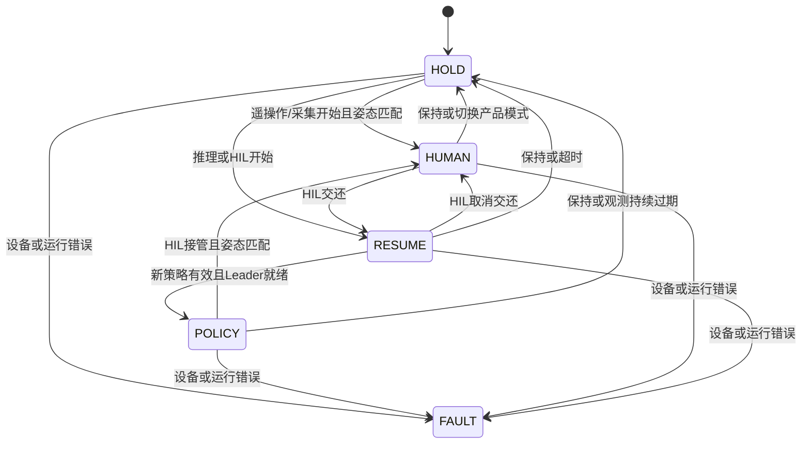

# 四模式工作站架构

本文描述当前实现：在 `1c04c83` 三模式基线上新增独立采集和双按钮仲裁。操作步骤由 [使用教程](hil_quickstart.md)维护，性能和同步策略由 [同步设计](synchronization_design.md)维护；外部项目比较见 [参考来源](reference_sources.md)。

## 职责

- 本项目：RK3588 的设备生命周期、采集、观测配对、动作仲裁、执行、记录与导出。
- condapi：模型训练、微调、转换和 Thor 本地模型服务。
- Thor 与 RK3588：现场以太网连接；不依赖云端推理。
- i2rt：底层驱动与重力补偿，固定在 `third_party/i2rt`；不另建第二套 SDK。

## 产品模式与内部状态

| 产品模式 | 动作来源 | Leader 行为 |
|---|---|---|
| teleop：遥操作 | 人工 | 重力补偿 |
| inference：推理 | 策略 | 不镜像，不参与动作决策 |
| hil：DAgger/HIL | 本地切换策略/人工 | 策略时镜像，人工时重力补偿 |
| collect：数据采集 | 人工示范，手动分段 | 重力补偿，顶部按钮开关录制 |

HOLD、RESUME、POLICY、HUMAN、FAULT 是内部状态，不再扩展成用户需要选择的产品模式。

交接姿态不匹配时留在/进入 HOLD。FAULT 不自动重试运动，需退出并重建会话。

## 单一控制拥有者

`Runtime.run()` 是本会话四臂命令的唯一上层拥有者。相机采集、网络推理、视频编码和 Web 控件不会直接驱动机械臂。i2rt 的各臂底层线程继续运行。

一次循环执行：读取状态与按钮 → 更新历史和观测 → 选择本地事件 → 仲裁策略/人工/保持 → 限幅 → 向 SDK 提交四臂目标 → 异步记录。

同一 tick 不等于四条 CAN 总线同时执行。记录各臂提交时间和状态年龄，保留可测的软件协调语义。禁止同时启动旧 GUI 的电机会话；当前尚无跨新旧入口的统一设备锁。

## 接管与恢复

1. HIL运行中顶部按钮或单击 `i` 请求整套双臂接管；不是握住 Leader 就切换。
2. 状态转换增加 epoch，使旧动作块和在途结果失效。
3. Leader 显式切到重力补偿，不套用其他机械臂的直接撤力矩方法。
4. 姿态接近时接入人工；超限保持，不把 Follower 拉向旧 Leader 姿态。
5. 扳机无法被模型驱动。接管时保持夹爪目标，扳机接近或跨过目标后才取得控制权。
6. 再次按键进入 RESUME：Leader 受限跟随当前 Follower 姿态，使用新观测推理，通过检查后执行新动作。

人工期间不提交新的策略请求；已在途结果可返回，但不可执行。切换模式先 HOLD，再由操作者开始。硬件故障时尽力保持，退出可能撤力矩；实际效果仍需真机验收。

## 模块映射

路径均相对 `yam_abc_reproduce/`。

| 模块 | 当前职责 |
|---|---|
| `hil/run.py` | 入口、运行循环、输入事件、统计、资源装配 |
| `hil/core.py` | 四模式状态机、交接、epoch、动作块与时效 |
| `hil/session.py` | 本地事件优先于同 tick 策略结果，提交/接收推理 |
| `hil/policy.py` | 单在途工作线程与 OpenPI WebSocket 协议 |
| `hil/station.py` | 四臂 IO、限位、Leader 模式与 SDK 提交 |
| `robot/yam_adapter.py` | i2rt 边界、官方 Leader 增益/重力补偿 |
| `camera/worker.py`、`hil/observation.py` | 相机短历史、接收时间配对、状态插值 |
| `hil/recording.py`、`hil/export.py` | 有界片段管理/视频记录、连续专家段导出 |
| `hil/buttons.py` | 左右官方 Leader 按键边沿、持续保持和模式主操作 |
| `hil/keyboard.py`、`hil/web.py` | 终端/本机网页输入 |

`hil/snapshots.py` 是早期独立帧缓冲原型，仍有单元测试，当前 Runtime 使用 `hil/observation.py`；后续应统一，见 [优化建议](optimization_review.md)。

## 推理与记录

默认非 RTC 异步重规划：执行有效旧块期间请求新块；按观测参考时间和 `action_dt` 裁掉过期前缀。当前不做动作块融合或时间集成。`--baseline` 保留不预取分块用于比较。

输出严格为有限的 50×14 绝对动作，模型契约见 [condapi 接口](condapi_interface.md)。限幅约束的是提交目标相对当前姿态的步长，不是实际速度或碰撞安全保证。

记录保留原始策略块、当前策略建议、人工输入、选中动作、最终提交命令和测量状态。提交到 SDK 不代表机械臂已到达。策略缺失为 null，并有有效性掩码；连续有效人工段才导出为专家片段。

## 已验证与未验证

[第一版证据](evidence/20260908-hil-runtime-v1.json)覆盖历史三模式、网络迟到、模式切换、协议往返、驱动替身、视频长度和专家段拆分。没有真实四臂或 Thor/RK3588 性能结论。

当前优先补可靠性和现场诊断；多进程、C++ 执行器和曝光时钟标定按实测需要引入，不作为第一版前提。

## 第四模式：数据采集

`collect` 复用遥操作的 HUMAN 控制，不请求模型。`RecordingSession` 在有界后台队列中处理 episode 开始、帧和结束，视频封装不在控制循环。其余模式持续记录，模式切换切开 episode；采集模式由操作者显式分段，未录制时不保存逐帧数据。人工采集是 `source=human`、`is_intervention=false`，HIL 人工接管才标记干预。具体双按钮映射见 [采集手册](collect.md)。
