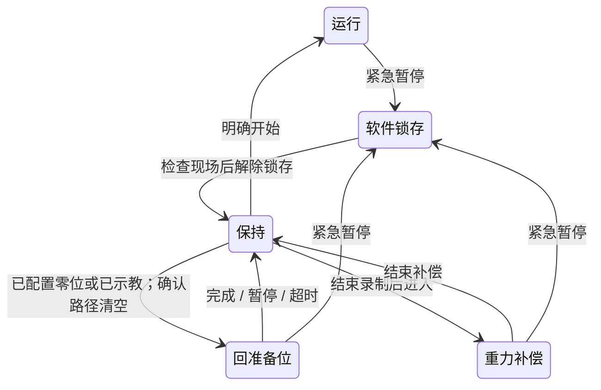

# 设备与采集平台使用手册

## 设备与采集平台的交付入口

用户2026-09-14确认：原采集平台升级为设备与采集平台，已有设备本体调试界面作为设备初始化、调试、维护的统一入口。日常设备连接/检查、准备位、重力补偿、允许的点动、状态查看与故障恢复都应在同一平台完成，不要求操作者另跑CLI并手写结果。既有四运行模式保留，维护操作在单一Runtime内互斥；本要求不扩展为编码器清零或底层速度调参界面。

交付时系统记录会话、操作者动作请求、设备/配置身份、关键状态变化和操作结果/错误，用户可在页面查看或导出；维护/调试记录与训练episode区分，不能把回位/调试动作混成训练示范。已有页面功能、自动记录覆盖和需要补齐的部分须按实际实现检查，用户说已有界面不等于完整记录链已验收。

正式部署通过IPC地址和8766（可配置）直接访问；目标IPC当前入口为
`http://192.168.110.140:8766`。默认仍绑定127.0.0.1用于开发，正式服务显式传
`--web-host 192.168.110.140`，Host与Origin检查保持启用。数据平台8767及完整跨平台验证边界归
[局域网交付](dagger_architecture.md#局域网访问与跨平台交付)。

本版入口为 `uv run --no-sync yam-workstation`，使用独立的四模式界面与统一执行循环。
旧 `yam-abc-gui` 保留上游采集/转换等功能；不要同时让旧会话和新工作站打开相同CAN设备。
四臂、三D405与短集录制已在RK3588现场验证；Thor真实模型、长时完整性及急停/恢复全流程仍待验收。

## 环境与无硬件试用

在本项目目录执行，使用现有 `.venv`，不安装模型训练后端：

```bash
cd /home/wuyan-lyj/YAM/yam-abc-reproduce
uv sync --locked --extra camera --extra gui --extra deploy
uv run --no-sync yam-workstation --mock --mode collect --web-port 8766
```

浏览器打开 http://127.0.0.1:8766 。页面初始不连接设备。普通遥操作可不选任务、不接相机，直接
连接机械臂后开始；该模式不录制。正式采集先创建/选择任务，再分别连接相机和机械臂；
机械臂连接后先保持，再点击“开始”执行；mock 不需要真实机械臂或Thor。
IPC正式入口由用户级systemd服务保持；开发机的mock命令仍只监听本机。
不要直接以`file://`打开`hil/static/index.html`作为版本验收：页面资源引用`/assets/`且需要后端`/status`等接口。开发机用上述HTTP mock入口；IPC用正式8766入口，分别检查HTML与`/assets/app.js`响应，而非比较浏览器缓存的旧标签。

```bash
# 生产：常驻设备owner（私有Unix socket，不开放局域网端口）
uv run --no-sync yam-workstation --device-daemon \
  --device-socket /run/user/$(id -u)/yam-device.sock \
  --mode collect --url ws://192.168.250.1:8000

# 生产：可独立重启的Web/API
uv run --no-sync yam-workstation --web-only \
  --device-socket /run/user/$(id -u)/yam-device.sock \
  --web-port 8766 --web-host 192.168.110.140

# 兼容开发：旧单进程入口
uv run --no-sync yam-workstation --mode collect --web-port 8766 \
  --web-host 192.168.110.140
```

systemd正式部署直接使用`deploy/yam-device.service`和`deploy/yam-workstation.service`；日常页面更新只执行`systemctl --user restart yam-workstation.service`。首次从旧单进程迁移或重启`yam-device`会释放力矩，必须先支撑机械臂。通配监听`0.0.0.0`不会隐式信任所有Host，必须至少补一个`--web-allowed-host <IP或主机名>`。

自动模拟策略→人工→恢复，并录制一个短episode：

```bash
uv run --no-sync yam-workstation --mock --demo --duration 4
```

终端末尾显示状态，输出默认在 `data/episodes/hil_年月日_时分秒/`；目录已存在会拒绝覆盖。
`--demo`只允许mock。`--baseline`选择不预取的`sync_hold`对照；默认是非RTC异步重规划。

## 界面工作流

带 `--web-port` 的交互启动使用浏览器控制，不从后台终端读取按键；保持浏览器页面打开。浏览器支持s/i/空格、1–4、r/x、g/f，输入框或确认对话框打开时不拦截打字。不带界面的CLI保留原终端键盘操作。

1. 普通遥操作直接连接机械臂；正式采集可先新建或选择任务并连接相机，也可从无任务遥操作先暂停保持、连接相机、首次选任务后切换采集，四臂无需断开。任务一旦绑定，换任务仍须断开并保存。模型模式连接机械臂时填写Thor WebSocket地址。真实连接确认现场固定、清空行程、有人照看；构造设备就可能施力矩与校准夹爪。
   设备初始化连接会临时锁定任务与运行模式；完成验收或点击“进入工作台”后在同一保持会话中转为普通遥操作，不断开机械臂。随后可新建/选择任务；绑定任务后四模式全部开放，未绑定任务时只开放不录制的遥操作。
2. 选择四种模式之一。切换会结束旧片段并保持，不立即运动；点击开始执行。操作按钮根据实际状态启用。
3. 采集时查看三路画面、录制时长、已写帧数、当前控制权。手柄①/②规则保持不变。
4. 标记结果、结束录制；离开设备前先支撑机械臂，点击“断开并保存”。原始数据保存后即可重新连接；采集程序不执行LeRobot转换。

机械臂连接会按官方1 Mbit/s命令拉起所需CAN接口，已在线的接口不会因每次连接而被重置；不响应的USB-CAN适配器才使用显式CAN重置。电机未应答与录制队列满是不同故障，不能以重置总线掩盖录制性能问题。

`--output`在交互界面中作为会话根目录：有任务连接时直接写入任务UUID下的新会话；无任务遥操作先写入同一文件系统的兄弟临时目录，首次绑定时原子迁到任务UUID目录。不带界面的CLI仍直接写到指定目录。浏览器心跳超过3秒未更新时，独立监测线程请求暂停并取消待执行动作；页面恢复不会自动运动。这不是对进程卡死、断电或总线失效的硬件保护。

## 软件暂停、回准备位与重力补偿

普通暂停使用空格/暂停按钮；顶部红色“紧急暂停”是软件锁存停止。后者冻结四臂目标、作废旧策略、取消回位/点动/补偿，活动集标为aborted。SDK或硬件故障仍采用故障锁定，不能用“解除锁存”绕过。



解除锁存后不会重放旧动作。物理急停需按实际硬件流程解除，并检查设备、重新连接；网页按钮不能解除物理急停或保证四臂瞬时停稳。

解除软件锁存后，只要设备在线、处于HOLD且未录制，Follower回零与重力补偿立即恢复可用；录制/编码故障不得把设备恢复按钮一并锁死。按钮禁用时页面直接显示缺少的条件。维护超时属于上一次操作结果，点击暂停确认或解除锁存后清除，不作为后续回零的永久阻断。

“回准备位”是当前控制循环执行的互斥关节插值流程，模型/遥操作在此期间不拥有控制权。本站`factory_zero_home: true`按YAM官方定义只把两台Follower的六关节送到零角度，**不写电机编码器零点**；Leader保持手动/重力补偿，不接收位置回零目标，两只Follower夹爪保持当前开度。其他站可使用示教的四臂准备位。Follower关节最大轨迹速率0.12rad/s；反馈落后规划0.12rad时暂停轨迹推进，恢复跟随后继续，因此正常负载不会因墙钟轨迹持续前推而提前中止。反馈完全停滞5秒或已提交轨迹与反馈异常相差超过0.15rad才暂停，并报告具体机械臂和关节；最长60秒。维护轨迹使用自身限速与反馈保护，不再被推理速度包络二次裁剪；轨迹到达末端时必须提交最终零目标后才完成。没有碰撞规划，点击前须确认从当前姿态到零位的完整路径安全。

仅非零位站把示教准备位保存到本机 `data/workstation/ready_real.json`；mock使用独立文件，与station配置SHA256绑定，配置变化后不会加载旧准备位，不提交Git。不要在浏览器多开多个控制操作员会话；当前没有多人控制权租约。

重力补偿时四臂关节可手动摆放，Follower夹爪保持。Follower沿用SDK重力补偿与阻尼，退出后恢复原位置控制参数；2026-09-14在腕部相机安装条件下通过现场定性检查，长时下垂与精确末端负载未量化。关节点动仅开放于采集模式、保持且未录制，单次有限步长；这些维护动作不进入训练片段。

## 三路预览与健康信息

原始相机采集默认30Hz；预览最多5Hz，输出480×360 JPEG。最新帧通过一个共享内存槽交给独立进程，编码器单线程、Linux降低调度优先级；锁忙或输出队列满时丢预览帧，不等待录制队列。HTTP仅返回已编码缓存，不按请求重编码。过期画面不继续冒充实时画面。

关闭预览会退出编码进程，相机采集和原始落盘继续。采集/控制线程不执行预览JPEG编码；共享CPU、内存带宽和操作系统调度仍存在资源竞争，不能承诺零影响。开发机开关预览对照见 [验收](acceptance.md)，RK3588须重复长时测试。

健康信息包括SDK状态帧龄、三相机帧龄/采集fps、到达时间偏差、控制工作耗时p95、录制队列、磁盘空间。它们不是逐电机CAN包时间、曝光同步、真实力矩检测或物理急停回路反馈。模型“已配置”不等于模型服务已经验证。

## 操作规则

固定零位站点的「零位与重力补偿」面板分别提供Follower回零与Leader回零。Leader回零只驱动两台Leader的六关节，Follower及夹爪保持；沿用0.12rad/s维护轨迹和反馈保护，结束后Leader恢复重力补偿。长手柄完整路径须现场确认。软件急停优先冻结四臂；解除锁存不恢复旧回零轨迹。回零不写编码器零点。

Leader回零专用Kp为原生40%（普通跟随仍20%），Kd不变；完成、暂停或急停退出回零增益，不调整跟踪/停滞阈值。该提高仅经离线验证，真机到位能力须现场验收。

### 固定记录回放诊断（无Thor）

本地源只读取已完成集的`submitted_action`，不构造机械臂或请求Thor：

```bash
python -m yam_abc_reproduce.hil.replay_policy /data/YAM/data/episodes/任务/会话/episode_000005 --steps 38 --port 8002
```

长集可用`--all`代替`--steps`，从所选起点播放到末尾一次；加载时仅保留14维动作，不累计图像或完整推理记录。2026-09-18选定「乐高分拣3」`session_20260918_093240_c22760/episode_000004`：9504帧、全部逐帧policy_fusion=rtc、约316.8秒动作；manifest旧TDA标签不代表实际逐帧模式。此处回放已记录的提交动作，不向Thor重新推理，也不重演RTC请求时序。

回放客户端随请求携带`_replay_cursor`（next_frame、epoch），仅在SDK下发成功后确认进度；发送50帧不等于执行50帧。暂停保留已提交断点，重新开始检查当前位置与断点目标的偏差，超过0.2rad拒绝；回零或进入重力补偿后重置至起点。此游标仅发给握手标记recorded_replay的服务，普通Thor请求移除此字段。更新此协议须同步更新设备进程与回放服务；旧客户端无确认字段会被拒绝。

在IPC运行，模型地址改为`ws://127.0.0.1:8002`，选择**同步推理·完整50步**，HIL模式可验证Leader镜像。回放使用已有控制owner/硬限位/主从误差保护/页面急停。每连接从所选起点开始；起始关节与观测偏差超过0.2rad则拒绝，不自动跳到起点。每50步等待下一块，**不是原始墙钟时间的无缝重现**。不足50步或文件结束时重复最后目标，直到操作者暂停；不会循环回到开头。握手及回复标记`recorded_replay`、`rtc_used=false`，RTC模式会拒绝该服务。默认50帧，完整集使用`--all`。

已建立模型通信客户端的会话可在HOLD、未录制时，通过推理面板「推理 / 回放地址 → 切换来源」独立重建通信子进程，不断开四臂；切换清除旧动作和回放进度，不自动运动。模式另选：回放用同步完整50步，RTC服务用RTC。连接失败仍保持，不回退旧来源。首次未配置任何模型客户端的会话仍需连接时配置地址。不能绕过设备owner另开SDK并发写电机。服务启动本身不使能、不运动。

### 日常操作

| 操作 | 终端 | 界面/手柄 |
|---|---|---|
| 选择遥操作/推理/HIL/采集 | 1 / 2 / 3 / 4 | 无任务只开放遥操作；选择后先保持 |
| 开始或从保持恢复 | s | 开始/恢复 |
| HIL冻结并介入 | i（单击） | 只能键盘/界面触发；手柄不介入 |
| HIL冻结后开启遥操作 | 右Leader①重新按下 | 保持至按键；解锁后恢复手动重力补偿，左①不解锁 |
| HIL人工阶段交还模型 | 界面 | 手柄①；其他阶段不生效 |
| 暂停运动 | 空格 | 界面暂停；不占手柄按钮 |
| 采集开关录制 | r | 手柄①（只管理录制，不启动机械臂） |
| 放弃当前采集集 | x | 手柄②；不暂停遥操作 |
| 标记成功/失败 | g / f | 成功/失败按钮，标记当前整个episode |
| 结束并关闭设备 | q | 结束会话 |

遥操作与HIL人工阶段leader为重力补偿。HIL策略阶段Leader与Follower共用最终六关节目标（硬限位后），不再追随滞后的Follower反馈；手柄夹爪仍是输入，不下发模型夹爪值。30Hz直达SDK时两者关节目标相同，但不保证物理位置或总线下发时刻完全一致。若启用备用100Hz二阶通道，Leader只在30Hz采样其输出，不复制原始未滤波目标。
扳机只作输入，接管时先保持夹爪，扳机到达/跨过当前夹爪目标才获得控制权。
两臂一起接管。普通遥操作采用 Leader→Follower 绝对 1:1 关节映射；HIL 人工接管从主从当前位置建立相对接管偏移，不要求操作者先精确对齐，
也不会在开始瞬间把 Follower 拉向 Leader 的旧位置。
恢复时受限对齐leader，并取新观测推理；旧请求和旧块无效。
纯推理模式leader不镜像、不决定follower动作。模式切换不会重建四臂，会关闭旧片段；
所有模式都先保持。遥操作始终不创建训练片段；HIL/推理在明确点击开始后创建片段，采集模式
由录制按钮或手柄按钮控制。

保持是软件停止目标更新，不是硬件急停。硬件故障时尝试全站保持并锁定故障，
等待明确退出，不自动继续；SDK自身的超时/电机保护仍有效。
退出会关闭SDK控制，可能撤掉力矩，必须先支撑机械臂；启动构造可能施力矩并校准夹爪。

## 真机配置与启动

专用文件`configs/station_hil.yaml`已登记官方电动Leader、两只实测`linear_4310`夹爪行程、三台D405的序列号/角色与四路CAN映射。迁移新设备时重新核对这些物理身份和行程；启用Thor前还须核对模型任务prompt与condapi模型`action_dt`（动作样本间隔）。

保留现有编码器零点，不运行GELLO清零。本站固定以官方六关节零角度作为准备位；只有明确点击回位才运动，服务重启/连接不自动回位。
必要时按已核验值填写每臂 `gripper_limits: [closed, open]`，未填写会由SDK测行程。DM4310
重启后可能把同一物理角度报告在相邻的 `2π` 圈；部署补丁会把保存的两个端点整体平移到当前圈，
不改变开闭顺序或跨度。日常命令限制在标定硬端点内侧2%，避免在机械挡块上长期位置保持。

完成现场固定、行程清空和人员照看后，先遥操作：

```bash
uv run --no-sync yam-workstation --mode teleop --web-port 8766
```

Thor已经启动condapi兼容的本地模型服务后，使用其现场IP：

```bash
uv run --no-sync yam-workstation --mode hil --url ws://THOR_IP:8000 --web-port 8766
```

`THOR_IP`替换为实际值。纯推理使用 `--mode inference`。不提供URL的真实遥操作会话不能
切入推理/HIL，需断开后填写URL重新连接。无自动重连执行；网络错误会锁定故障。
模型接口为扁平RGB HWC uint8三图、14D状态、prompt，输出50×14绝对动作；
Thor已反馈关节输出是rad绝对目标、夹爪0关/1开，Thor完成反归一化、关节delta→absolute和32D→14D；RK不再次反归一化或加状态。有限夹爪预测即使超出[0,1]也由RK裁剪，NaN/Inf仍拒绝，关节按SDK硬限位。
客户端消费协议要求的首条服务元数据，但不保存模型名称、后端、指纹或服务URL；任务效果仍需另验收。

## 推理模式与RTC

页面在模型执行时显示设备进程报告的策略轨迹状态；不能由浏览器缓存或磁盘文件推断运行算法。实验性纯线性100Hz轨迹已删除，历史失败证据保留在[验收](acceptance.md#2026-09-16-线性插值推理短测与回退)。

当前操作模式只列三种：同步推理、TDA推理、RTC推理。`configs/station_hil.yaml`默认普通模型的`tda_smooth`；训练式RTC可在新版页面HOLD且未录制时选择，严格要求Thor握手声明训练式RTC、H50/14D/30Hz，失败不会退化为普通模型。同步推理的`sync_hold`不预取，顺序执行每块**全部50步**，随后保持最后提交目标并请求下一块，从新块第0步执行；保持位置力矩，不是电机失能，也不是RTC。普通异步模式的1.5秒观测龄保护不足以覆盖50/30≈1.67秒加推理耗时；同步模式从回复到达起单独限定50步执行墙钟期限，等待下一回复仍受原有请求超时保护，超时进入HOLD需重新开始。`--baseline`选择同一路径。同步等待会带来每块约一次推理往返时长的停顿，不声称已通过真机效果验收。训练时RTC的已承诺前缀不能经TDA混合。

TDA实现从`/home/wuyan-lyj/openarm-vr/src/openarm_remote_policy/openarm_remote_policy/ws_policy_client.py::ActionChunkQueue`复用算法，默认`drop_max=25`、`min_overlap=1`、`linear`；保留YAM本有的50×14有限值检查、夹爪[0,1]裁剪、关节SDK限位和故障HOLD。它混合完整重叠区，不能视为仅处理几步换块边界；旧YAM固定窗口`smooth`已移除。TDA队列按消费步数对齐，不声称能替代RTC目标tick合同。

推理/HIL页面显示Thor往返p95、动作缓冲余量、RTC已承诺前缀步数及实际下发路径。HOLD且未录制时可切换`sync_hold/tda_smooth/rtc`；跨RTC边界只在后台重载Thor通信子进程，不断开四臂。提交后控制线程清空旧缓冲、递增epoch，下一次明确开始才执行新设置。改动只保存在当前设备会话，断开重连恢复station YAML默认。30Hz直接下发路径不再对策略关节或夹爪施加“相对实测位置×每步时间”的应用层速度裁剪；SDK关节硬限位、策略夹爪[0,1]限幅及故障HOLD保留。每行录制样本的`details.policy_fusion`是当时生效模式；历史`raw`录制仍可用于旧会话分析，不表示它是新版可选模式。结合`policy_action`、`bounded_action`、`submitted_action`与后续`measured_state`判读。

RTC默认`d=9`（首次实测`d=8`有一次迟到2 tick、一次零余量）：以相机配对帧的主机到达时间映射最近30Hz tick `N`，把`N..N+d-1`真实已提交/已锁定目标发给Thor；返回新块只从`N+d`接管。HOLD且未录制时可在页面调整“前缀步数”1–10，生效会清空旧计划，不需要为此重启机械臂。晚到不顺延、不补执行旧步；超过期限、缓冲耗尽仍HOLD。切换/暂停/急停作废旧请求。RTC不经TDA、夹爪低值trick或100Hz二阶；关节只过SDK硬限位，**有限夹爪先裁到[0,1]再校验目标**。主机到达时间不等于硬件曝光时间，真机闭环效果尚待操作员验收；首次部署本版控制循环仍需一次经现场确认的受控设备重启。

本仓库新版把Thor通信与动作块规划分成两个子进程：网络工作线程拿到回复后在后台请求规划，30Hz控制线程只读取已安装计划，不等待网络或规划。TDA完整重叠融合和同步完整块规划在规划进程中；设备进程保留通用时间轴/队列消费、epoch/时效、HOLD/接管/急停、SDK硬限位及唯一SDK写入权。页面在HOLD且未录制时可分别“重载 Thor 通信”和“重载动作规划”，不会主动断开CAN或释放力矩；规划进程失联时策略进入HOLD，旧回复不能恢复运动。**2026-09-17已在四臂支撑、现场照看下完成一次IPC受控迁移重启；四臂HOLD、规划子进程独立重载及HOLD下同步/TDA切换通过。随后同步模式完成两段真机短录制，但观察到大量反馈相对限幅，不能视为任务效果验收。**迁移后修改现有动作块算法只需在HOLD重载规划子进程；修改设备侧通用计划接口、安全仲裁或SDK控制仍要受控重启。两个子进程都就绪后才允许开始推理。
RK3588首次拉起子进程的Python模块冷导入可能超过单次Thor请求的1.5秒超时；后台启动最多等待8秒完成握手，期间页面保持模型“未就绪”、控制线程继续HOLD。此等待与已经开始的推理请求超时是不同边界。

高频轨迹写入可用`policy_trajectory_hz`显式开关；`0`是30Hz策略目标直接提交给现有YAM SDK，不加应用层100Hz轨迹。2026-09-17无融合对照仍将本站配置为`0`，以便先观察原始动作与底层跟踪；100Hz二阶执行器代码仍保留、此轮不启用。OpenArm-vr的30Hz目标发布、200Hz MIT控制器保持目标并做PD跟踪仅作为设计参照，不能声称YAM SDK具有相同的200Hz底层实现。此前100Hz、3rad/s、30rad/s²、临界阻尼10rad/s的二阶轨迹可能造成模型目标跟踪滞后；纯线性100Hz轨迹在2026-09-16现场短测被操作者判定动作明显异常，代码已删除，不重新启用。切换`policy_trajectory_hz`需要受控重启设备进程并释放力矩，须先支撑四臂。

2026-09-16旧二阶方案的82秒raw录制离线重放：4步交接使换块后4帧内关节目标最大单帧跳变的95%值从0.373降到0.140rad；8步为0.061rad但对新raw目标的95%最大关节偏差增至0.228rad。来源为IPC `session_20260916_164308_bb674f/episode_000001`，只证明接缝目标曲线变化，不是真机效果验收。纯线性插值失败短测及调度尖峰见[现场验收](acceptance.md#2026-09-16-线性插值推理短测与回退)。

推理录制的`segment_*/samples.h5`每行`details`现记录`policy_selection`：同目标时刻`joint_sources`列出融合来源、权重、观测时刻和模型小数索引，`gripper_source`给出实际夹爪来源；`smooth`模式的旧行可能已有融合，不能还原原始关节来源，此时`joint_sources=null`。`bounded_action/bounded_at`是30Hz仲裁后的目标；`policy_write_trace.samples`是可选100Hz二阶通道的独立流水，当前默认关闭。`submitted_action`是SDK实际提交目标；所有本机monotonic时间只在同一设备会话内比较，SDK调用返回不代表电机运动完成，必须与后续`measured_state`反馈对齐。

离线无设备检查与模拟延迟测试：

```bash
uv run --no-sync yam-workstation --mock --mode inference --check
uv run --no-sync pytest -q tests/test_action_planner_process.py tests/test_async_inference.py tests/test_rtc_timeline.py tests/test_rtc_protocol.py
CONDAPI_ROOT=/home/wuyan-lyj/condapi uv run --no-sync pytest -q tests/test_condapi_wire.py
```

Thor提供已核验的普通WebSocket policy后，在已支撑、行程清空且有人现场照看的IPC上使用当前服务的启动配置加入下列参数；若8766服务已运行，不另启第二个控制进程。先做无电机合同回放，再获现场许可进入短时纯推理：

```bash
uv run --no-sync yam-workstation --station configs/station_hil.yaml \
  --mode inference --url ws://192.168.250.1:8000 --policy-fusion tda_smooth \
  --web-port 8766 --web-host 192.168.110.140
```

普通10w模型使用`--policy-fusion tda_smooth`；完整块同步对照使用`--policy-fusion sync_hold`；训练式RTC服务使用`--policy-fusion rtc`，或在HOLD页面切换。旧`raw`不再是启动或页面选项。RTC要求控制周期与动作间隔均为1/30秒、`policy_trajectory_hz=0`；不满足则拒绝启动。现场由用户明确开始真机推理，不能把离线探针当作运动验收。请求超时、缓冲耗尽仍保持；软件急停、接管、模式切换或重置后旧回复不能恢复运动。

TDA正常重规划间隔为333ms，即约执行10个30Hz动作后取最新观测发起下一次请求；若缓冲剩余时间已接近“最近16个有效回复的观测参考时刻→动作可用p95（初始0.2s）+67ms余量”，会动态提前。单在途期间不排队旧观测。同步模式完整执行50步后再请求新块。状态接口同时报告缓冲秒数、请求RTT、端到端观测延迟、动作索引、裁掉步数和最终提交目标相对策略目标是否受硬限位改变。

## 实用同步与性能默认值

第一版沿用采集线程，增加8帧历史；状态历史128条；网络使用独立线程。
控制与相机采集使用线程；录制、预览各自使用固定共享缓冲和独立编码进程，不称为硬实时框架。

| 配置 | 默认 | 行为 |
|---|---|---|
| 上层control_hz | 30Hz | 四臂同tick；SDK继续负责底层循环 |
| warn_frame_skew | 40ms | 三图接收时间差超过只记警告 |
| max_frame_skew | 120ms | 超过不生成本次新观测 |
| max_frame_age | 500ms | 短暂缺图继续有效块；持续过期转保持 |
| max_state_age | 250ms | SDK状态循环停止更新则故障；不是每个CAN电机的独立接收时间 |
| request/action_timeout | 1.5s / 1.5s | 拒绝明显过期请求/动作 |
| tick_timeout | 500ms | 严重控制停顿锁故障，普通miss只统计；不追赶补发旧周期 |
| replan_period | 333ms（约10步） | 正常重规划间隔；缓冲截止时间紧迫时可提前 |
| expected_policy_latency / prefetch_margin | 200ms / 67ms | 首次总往返预算/两个30Hz周期余量；收到有效回复后按最近16次本机往返p95更新 |
| handover/mirror_error | 0.2 / 0.5rad | 策略恢复交接门限/运行中的leader大偏差保持；普通遥操作使用绝对1:1关节目标，不受HIL交接门限阻挡 |
| policy_trajectory_hz / policy_trajectory_joint_speed | 0 / 3rad/s | 当前直接以30Hz提交策略目标，后者仅供显式启用的实验性100Hz二阶轨迹使用；不是当前推理限速 |

这些是可调的开发默认值，不是现场性能证明或最终控制参数。
D405无三机外部硬同步；本版按**主机接收时间**配对与关节历史插值，
保留设备时间/时间域/帧号，但尚未标定曝光时钟偏移。观测插值仅用于模型/记录；
控制约束使用最新真实状态。以后实测需要再加时钟校准、多进程或硬件优化。

推理将动作第0步对齐obs参考时刻，再用`action_dt`定位当前动作、裁掉过期前缀；没有额外“第0步时间偏移”配置，不会因为控制Hz变化而把模型时间轴加速。新块替换尚未执行的未来计划，约束后的命令另存；同目标时刻融合仅按上述参数显式启用，不做RTC或模型侧改变。

## 记录与训练导出

每次运行的会话目录中，`episode_000001/`等子目录各保存一集。会话创建时写`session.json`，每集含分段`samples.h5`、三路MP4、`segment.json`及完成时的`manifest.json`；旧JSONL集继续可读。HDF5保留人工/策略/实际提交动作、最新反馈、同步质量、阶段/事件时间、图像视频索引；没有策略预测时保留无效标记。视频按控制帧索引对应，重复选中的相机帧可以重复写入，缺图不伪造新帧。
推理rollout和DAgger/HIL在运动启动时自动创建episode；遥操作不自动录制，数据采集只在页面或手柄①显式开始后记录。
会话队列默认约10秒容量（30Hz时300个采集时刻），这是提交线程的短时RAM保护参数，不是相机/MPP硬限制；每项主要包含三路RGB引用及该时刻状态。单集后台收到一项后先原子写入episode内的`.recording-spool`，MPP/HDF5再按序消费；仅在该视频/HDF5分段提交后删除对应原图。因此编码暂时低于30Hz时积压增长在NVMe而非图像RAM；正常结束后临时目录为空并删除。磁盘逼近`min_free_bytes`会明确停止，异常退出留下的spool不能直接冒充已提交MP4，须检查或离线恢复。停录后只要持续有保存进展就继续排空，连续120秒完全无进展才报故障。设备控制保留CPU4–7，录制/编码及FFmpeg固定到CPU0–3，避免100Hz策略写入与编码Python桥接争抢同组核心；仍不承诺无限时长、磁盘耗尽或断电情况下的数据完整。

导出连续人工有效段到现有canonical格式，可继续用原转换链处理：

```bash
uv run --no-sync python -m yam_abc_reproduce.hil.export data/episodes/实际会话/episode_000001 --output data/expert/新目录
```

策略/保持段不作为专家标签；遇到非人工段或epoch变化就拆成新episode，不把过滤后的
间断动作拼成连续轨迹。故障episode默认拒绝导出，需要先审核数据。
保留 `hil_provenance.jsonl`；原LeRobot转换器未自动映射这些额外HIL字段，
只通过canonical接口转换专家状态/动作/图像；模型微调仍归condapi。

## 现场下一步

四臂、三相机、遥操作与短集采集已通过阶段性现场验收。后续以有人照看的运动中录制对照、长时队列斜率与完整回读、急停/恢复，以及Thor真实模型合同和任务效果为下一批闸门；不以三台D405无法达到的同时曝光为上线前提。

## 数据采集与双按钮

数据采集使用`--mode collect`，不需要Thor URL。完整操作、按钮优先级、结果标记和目录布局见[采集手册](collect.md)。推理/HIL明确开始后记录，遥操作不创建训练集；模式切换结束上一段，进入采集后等待明确录制操作。

## 默认LeRobot输出

工作台和无界面CLI均只保存MP4＋HDF5；使用独立脚本生成LeRobot，见 [字段和格式](convert.md)。运行时只异步录制原始数据；`--raw-only`仅保留兼容，现在默认只录制。遥操作/推理模式两个手柄按钮均无功能。

## uv启动与离线检查

首次安装或依赖变化后，先 `uv sync --locked --extra camera --extra gui --extra deploy`。日常命令的 `--no-sync` 使用现有环境，不重新安装；无需激活 `.venv`。

```bash
uv run --no-sync yam-workstation --mock --mode collect --check
```

检查不连接设备、不创建录制目录。真机检查去掉 `--mock`，HIL/推理提供 `--url`；配置占位会拒绝通过。模块可发现不等于驱动可加载或设备可用。详见 [环境说明](environment.md)。
