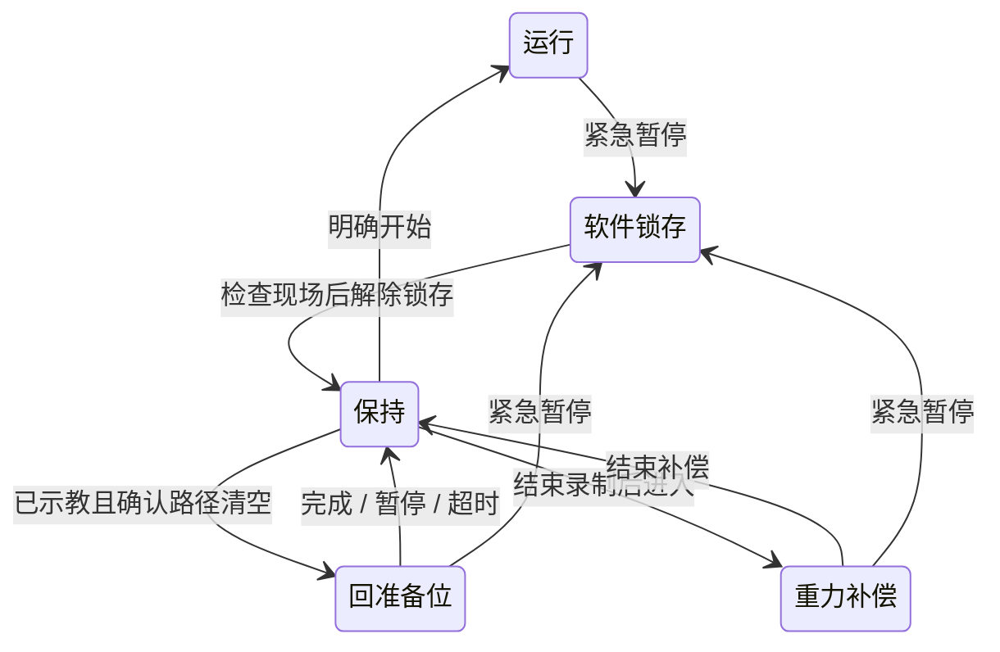

# 设备与采集平台使用手册

## 设备与采集平台的交付入口

用户2026-09-14确认：原采集平台升级为设备与采集平台，已有设备本体调试界面作为设备初始化、调试、维护的统一入口。日常设备连接/检查、准备位、重力补偿、允许的点动、状态查看与故障恢复都应在同一平台完成，不要求操作者另跑CLI并手写结果。既有四运行模式保留，维护操作在单一Runtime内互斥；本要求不扩展为编码器清零或底层速度调参界面。

交付时系统记录会话、操作者动作请求、设备/配置身份、关键状态变化和操作结果/错误，用户可在页面查看或导出；维护/调试记录与训练episode区分，不能把回位/调试动作混成训练示范。已有页面功能、自动记录覆盖和需要补齐的部分须按实际实现检查，用户说已有界面不等于完整记录链已验收。

正式部署通过IPC地址和8766（可配置）直接访问；目标IPC当前入口为
`http://192.168.110.140:8766`。默认仍绑定127.0.0.1用于开发，正式服务显式传
`--web-host 192.168.110.140`，Host与Origin检查保持启用。数据平台8767及完整跨平台验证边界归
[局域网交付](dagger_architecture.md#局域网访问与跨平台交付)。

本版入口为 `uv run --no-sync yam-workstation`，使用独立的四模式界面与统一执行循环。
旧 `yam-abc-gui` 保留上游采集/转换等功能；不要同时让旧会话和新工作站打开相同CAN设备。
四臂、三D405与短集录制已在RK3588现场验证；Thor真实模型、长时完整性及急停/恢复全流程仍待验收。

## 环境与无硬件试用

在本项目目录执行，使用现有 `.venv`，不安装模型训练后端：

```bash
cd /home/wuyan-lyj/YAM/yam-abc-reproduce
uv sync --locked --extra camera --extra gui --extra deploy
uv run --no-sync yam-workstation --mock --mode collect --web-port 8766
```

浏览器打开 http://127.0.0.1:8766 。页面初始不连接设备。普通遥操作可不选任务、不接相机，直接
连接机械臂后开始；该模式不录制。正式采集先创建/选择任务，再分别连接相机和机械臂；
机械臂连接后先保持，再点击“开始”执行；mock 不需要真实机械臂或Thor。
IPC正式入口由用户级systemd服务保持；开发机的mock命令仍只监听本机。

```bash
uv run --no-sync yam-workstation --mode collect --web-port 8766 \
  --web-host 192.168.110.140
```

通配监听`0.0.0.0`不会隐式信任所有Host，必须至少补一个
`--web-allowed-host <IP或主机名>`。服务启动只打开页面，不构造相机或机械臂。

自动模拟策略→人工→恢复，并录制一个短episode：

```bash
uv run --no-sync yam-workstation --mock --demo --duration 4
```

终端末尾显示状态，输出默认在 `data/episodes/hil_年月日_时分秒/`；目录已存在会拒绝覆盖。
`--demo`只允许mock。`--baseline`切回不预取的普通分块基准；默认是非RTC异步重规划。

## 界面工作流

带 `--web-port` 的交互启动使用浏览器控制，不从后台终端读取按键；保持浏览器页面打开。浏览器支持s/i/空格、1–4、r/x、g/f，输入框或确认对话框打开时不拦截打字。不带界面的CLI保留原终端键盘操作。

1. 普通遥操作直接连接机械臂；正式采集可先新建或选择任务并连接相机，也可从无任务遥操作先暂停保持、连接相机、首次选任务后切换采集，四臂无需断开。任务一旦绑定，换任务仍须断开并保存。模型模式连接机械臂时填写Thor WebSocket地址。真实连接确认现场固定、清空行程、有人照看；构造设备就可能施力矩与校准夹爪。
2. 选择四种模式之一。切换会结束旧片段并保持，不立即运动；点击开始执行。操作按钮根据实际状态启用。
3. 采集时查看三路画面、录制时长、已写帧数、当前控制权。手柄①/②规则保持不变。
4. 标记结果、结束录制；离开设备前先支撑机械臂，点击“断开并保存”。原始数据保存后即可重新连接；采集程序不执行LeRobot转换。

机械臂连接会按官方1 Mbit/s命令拉起所需CAN接口，已在线的接口不会因每次连接而被重置；不响应的USB-CAN适配器才使用显式CAN重置。电机未应答与录制队列满是不同故障，不能以重置总线掩盖录制性能问题。

`--output`在交互界面中作为会话根目录：有任务连接时直接写入任务UUID下的新会话；无任务遥操作先写入同一文件系统的兄弟临时目录，首次绑定时原子迁到任务UUID目录。不带界面的CLI仍直接写到指定目录。浏览器心跳超过3秒未更新时，独立监测线程请求暂停并取消待执行动作；页面恢复不会自动运动。这不是对进程卡死、断电或总线失效的硬件保护。

## 软件暂停、回准备位与重力补偿

普通暂停使用空格/暂停按钮；顶部红色“紧急暂停”是软件锁存停止。后者冻结四臂目标、作废旧策略、取消回位/点动/补偿，活动集标为aborted。SDK或硬件故障仍采用故障锁定，不能用“解除锁存”绕过。



解除锁存后不会重放旧动作。物理急停需按实际硬件流程解除，并检查设备、重新连接；网页按钮不能解除物理急停或保证四臂瞬时停稳。

“回准备位”是当前控制循环执行的四臂关节插值流程，模型/遥操作在此期间不拥有控制权。先在重力补偿下手扶摆位，结束补偿后保存当前准备位；Follower夹爪在回位时保持原开度。到位误差阈值0.015rad，最长60秒；超过时间保持并报错。没有碰撞规划，不能把保存一个姿态等同于任意当前位置的回位路径已经安全。

准备位保存到本机 `data/workstation/ready_real.json`；mock使用独立文件，与station配置SHA256绑定，配置变化后不会加载旧准备位，不提交Git。不要在浏览器多开多个控制操作员会话；当前没有多人控制权租约。

重力补偿时四臂关节可手动摆放，Follower夹爪保持。Follower沿用SDK重力补偿与阻尼，退出后恢复原位置控制参数；2026-09-14在腕部相机安装条件下通过现场定性检查，长时下垂与精确末端负载未量化。关节点动仅开放于采集模式、保持且未录制，单次有限步长；这些维护动作不进入训练片段。

## 三路预览与健康信息

原始相机采集默认30Hz；预览最多5Hz，输出480×360 JPEG。最新帧通过一个共享内存槽交给独立进程，编码器单线程、Linux降低调度优先级；锁忙或输出队列满时丢预览帧，不等待录制队列。HTTP仅返回已编码缓存，不按请求重编码。过期画面不继续冒充实时画面。

关闭预览会退出编码进程，相机采集和原始落盘继续。采集/控制线程不执行预览JPEG编码；共享CPU、内存带宽和操作系统调度仍存在资源竞争，不能承诺零影响。开发机开关预览对照见 [验收](acceptance.md)，RK3588须重复长时测试。

健康信息包括SDK状态帧龄、三相机帧龄/采集fps、到达时间偏差、控制工作耗时p95、录制队列、磁盘空间。它们不是逐电机CAN包时间、曝光同步、真实力矩检测或物理急停回路反馈。模型“已配置”不等于模型服务已经验证。

## 操作规则

| 操作 | 终端 | 界面/手柄 |
|---|---|---|
| 选择遥操作/推理/HIL/采集 | 1 / 2 / 3 / 4 | 无任务只开放遥操作；选择后先保持 |
| 开始或从保持恢复 | s | 开始/恢复 |
| HIL冻结并介入 | i（单击） | 只能键盘/界面触发；手柄不介入 |
| HIL人工阶段交还模型 | 界面 | 手柄①；其他阶段不生效 |
| 暂停运动 | 空格 | 界面暂停；不占手柄按钮 |
| 采集开关录制 | r | 手柄①（只管理录制，不启动机械臂） |
| 放弃当前采集集 | x | 手柄②；不暂停遥操作 |
| 标记成功/失败 | g / f | 成功/失败按钮，标记当前整个episode |
| 结束并关闭设备 | q | 结束会话 |

遥操作与HIL人工阶段leader为重力补偿。HIL策略阶段镜像follower当前六关节姿态；
扳机只作输入，接管时先保持夹爪，扳机到达/跨过当前夹爪目标才获得控制权。
两臂一起接管。普通遥操作采用 Leader→Follower 绝对 1:1 关节映射；HIL 人工接管从主从当前位置建立相对接管偏移，不要求操作者先精确对齐，
也不会在开始瞬间把 Follower 拉向 Leader 的旧位置。
恢复时受限对齐leader，并取新观测推理；旧请求和旧块无效。
纯推理模式leader不镜像、不决定follower动作。模式切换不会重建四臂，会关闭旧片段；
所有模式都先保持。遥操作始终不创建训练片段；HIL/推理在明确点击开始后创建片段，采集模式
由录制按钮或手柄按钮控制。

保持是软件停止目标更新，不是硬件急停。硬件故障时尝试全站保持并锁定故障，
等待明确退出，不自动继续；SDK自身的超时/电机保护仍有效。
退出会关闭SDK控制，可能撤掉力矩，必须先支撑机械臂；启动构造可能施力矩并校准夹爪。

## 真机配置与启动

专用文件`configs/station_hil.yaml`已登记官方电动Leader、两只实测`linear_4310`夹爪行程、三台D405的序列号/角色与四路CAN映射。迁移新设备时重新核对这些物理身份和行程；启用Thor前还须核对模型任务prompt与condapi模型`action_dt`（动作样本间隔）。

保留现有编码器零点，不运行GELLO清零。准备位由现场示教保存，只有明确点击“回准备位”才运动。
必要时按已核验值填写每臂 `gripper_limits: [closed, open]`，未填写会由SDK测行程。DM4310
重启后可能把同一物理角度报告在相邻的 `2π` 圈；部署补丁会把保存的两个端点整体平移到当前圈，
不改变开闭顺序或跨度。日常命令限制在标定硬端点内侧2%，避免在机械挡块上长期位置保持。

完成现场固定、行程清空和人员照看后，先遥操作：

```bash
uv run --no-sync yam-workstation --mode teleop --web-port 8766
```

Thor已经启动condapi兼容的本地模型服务后，使用其现场IP：

```bash
uv run --no-sync yam-workstation --mode hil --url ws://THOR_IP:8000 --web-port 8766
```

`THOR_IP`替换为实际值。纯推理使用 `--mode inference`。不提供URL的真实遥操作会话不能
切入推理/HIL，需断开后填写URL重新连接。无自动重连执行；网络错误会锁定故障。
模型接口为扁平RGB HWC uint8三图、14D状态、prompt，输出50×14绝对动作；
关节弧度、夹爪0–1，需与condapi训练/输出变换一致，RK不再次反归一化或加状态。
当前接收并保存服务元数据，不代表已经验证checkpoint/norm或任务效果。

## 非RTC推理与可选动作融合

当前`configs/station_hil.yaml`默认`policy_fusion: raw`。`smooth`只在新旧块目标时刻匹配时对前`smooth_steps`步关节目标过渡；`ensemble`按新预测优先的指数权重融合最近`ensemble_chunks`块的同目标时刻关节预测，`ensemble_decay`控制旧预测权重。夹爪在两种方法中都取最新块，不混合开闭。三种选择不改变同步模式、Thor模型或50×14绝对动作协议；`--baseline`则关闭预取与融合，保留普通分块基准。

离线无设备检查与模拟延迟测试：

```bash
uv run --no-sync yam-workstation --mock --mode inference --policy-fusion smooth --smooth-steps 6 --check
uv run --no-sync pytest -q tests/test_async_inference.py
```

Thor提供已核验的普通WebSocket policy后，在已支撑、行程清空且有人现场照看的IPC上使用当前服务的启动配置加入下列参数；若8766服务已运行，不另启第二个控制进程。先做无电机合同回放，再获现场许可进入短时纯推理：

```bash
uv run --no-sync yam-workstation --station configs/station_hil.yaml \
  --mode inference --url ws://THOR_IP:8000 --policy-fusion raw \
  --web-port 8766 --web-host 192.168.110.140
```

获准并验证raw后，可改`--policy-fusion smooth --smooth-steps 6`，或`--policy-fusion ensemble --ensemble-chunks 3 --ensemble-decay 0.5`做运动对照。实际`THOR_IP`、checkpoint/norm、`action_dt`及动作索引0相对观测时刻的语义必须核对；不同则不能靠本机融合参数猜测。请求超过`request_timeout`、缓冲耗尽或动作超过`action_timeout`会保持；软件急停、接管、模式切换或重置后旧回复不能恢复运动。

## 实用同步与性能默认值

第一版沿用采集线程，增加8帧历史；状态历史128条；网络使用独立线程。
控制与相机采集使用线程；录制、预览各自使用固定共享缓冲和独立编码进程，不称为硬实时框架。

| 配置 | 默认 | 行为 |
|---|---|---|
| 上层control_hz | 30Hz | 四臂同tick；SDK继续负责底层循环 |
| warn_frame_skew | 40ms | 三图接收时间差超过只记警告 |
| max_frame_skew | 120ms | 超过不生成本次新观测 |
| max_frame_age | 500ms | 短暂缺图继续有效块；持续过期转保持 |
| max_state_age | 250ms | SDK状态循环停止更新则故障；不是每个CAN电机的独立接收时间 |
| request/action_timeout | 1.5s / 1.5s | 拒绝明显过期请求/动作 |
| tick_timeout | 500ms | 严重控制停顿锁故障，普通miss只统计；不追赶补发旧周期 |
| replan_period | 200ms | 最多一个在途请求，执行旧块时请求新块 |
| handover/mirror_error | 0.2 / 0.5rad | 策略恢复交接门限/运行中的leader大偏差保持；普通遥操作使用绝对1:1关节目标，不受HIL交接门限阻挡 |
| max_joint_speed / max_manual_joint_speed | 5.0rad/s / 无 | 策略与自动运动的每周期变化上限；人工遥操作关节与夹爪均不做应用层速度裁剪 |

这些是可调的开发默认值，不是现场性能证明或最终控制参数。
D405无三机外部硬同步；本版按**主机接收时间**配对与关节历史插值，
保留设备时间/时间域/帧号，但尚未标定曝光时钟偏移。观测插值仅用于模型/记录；
控制约束使用最新真实状态。以后实测需要再加时钟校准、多进程或硬件优化。

推理用obs时间与`action_dt`定位当前动作，裁掉过期前缀；不会因为控制Hz变化而把模型时间轴加速。新块替换尚未执行的未来计划，约束后的命令另存；同目标时刻融合仅按上述参数显式启用，不做RTC或模型侧改变。

## 记录与训练导出

每次运行的会话目录中，`episode_000001/`等子目录各保存一集。会话创建时写`session.json`，每集含分段`samples.h5`、三路MP4、`segment.json`及完成时的`manifest.json`；旧JSONL集继续可读。HDF5保留人工/策略/实际提交动作、最新反馈、同步质量、阶段/事件时间、图像视频索引；没有策略预测时保留无效标记。视频按控制帧索引对应，重复选中的相机帧可以重复写入，缺图不伪造新帧。
会话队列默认约10秒容量（30Hz时300帧），单集桥接队列32帧，编码进程仍有自身有界缓冲；满或写盘失败明确aborted。停录后允许有进展地继续排空，120秒完全无进展才报故障；不能无限积累整个episode，也不承诺断电后未完成MP4/manifest完整。

导出连续人工有效段到现有canonical格式，可继续用原转换链处理：

```bash
uv run --no-sync python -m yam_abc_reproduce.hil.export data/episodes/实际会话/episode_000001 --output data/expert/新目录
```

策略/保持段不作为专家标签；遇到非人工段或epoch变化就拆成新episode，不把过滤后的
间断动作拼成连续轨迹。故障episode默认拒绝导出，需要先审核数据。
保留 `hil_provenance.jsonl`；原LeRobot转换器未自动映射这些额外HIL字段，
只通过canonical接口转换专家状态/动作/图像；模型微调仍归condapi。

## 现场下一步

四臂、三相机、遥操作与短集采集已通过阶段性现场验收。后续以有人照看的运动中录制对照、长时队列斜率与完整回读、急停/恢复，以及Thor真实模型合同和任务效果为下一批闸门；不以三台D405无法达到的同时曝光为上线前提。

## 数据采集与双按钮

数据采集使用`--mode collect`，不需要Thor URL。完整操作、按钮优先级、结果标记和目录布局见[采集手册](collect.md)。推理/HIL明确开始后记录，遥操作不创建训练集；模式切换结束上一段，进入采集后等待明确录制操作。

## 默认LeRobot输出

工作台和无界面CLI均只保存MP4＋HDF5；使用独立脚本生成LeRobot，见 [字段和格式](convert.md)。运行时只异步录制原始数据；`--raw-only`仅保留兼容，现在默认只录制。遥操作/推理模式两个手柄按钮均无功能。

## uv启动与离线检查

首次安装或依赖变化后，先 `uv sync --locked --extra camera --extra gui --extra deploy`。日常命令的 `--no-sync` 使用现有环境，不重新安装；无需激活 `.venv`。

```bash
uv run --no-sync yam-workstation --mock --mode collect --check
```

检查不连接设备、不创建录制目录。真机检查去掉 `--mock`，HIL/推理提供 `--url`；配置占位会拒绝通过。模块可发现不等于驱动可加载或设备可用。详见 [环境说明](environment.md)。
